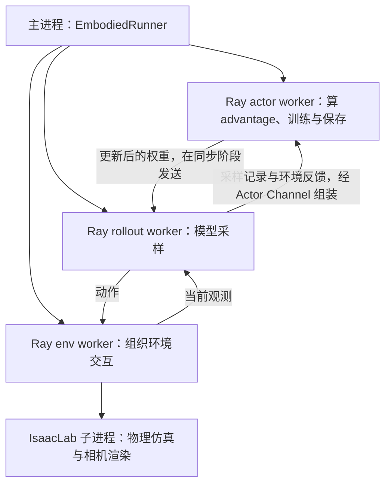

# 从环境反馈到一次参数更新：RL pipeline 调试学习指南

本文面向刚接触具身智能的读者，接着 [SFT pipeline 指南](SFT_PIPELINE_GUIDE.md)，围绕本项目已经接通的 **GR00T N1.7 + IsaacLab Franka 堆方块 + RLinf PPO** 展开。你可以一边读，一边在 VS Code 中暂停程序，观察机器人执行动作后的反馈如何变成梯度。

学习目标是亲眼跟踪这条链路：

> 加载 SFT 策略 → 同步采样权重 → 读取仿真观测 → 采样并执行动作 → 收集 reward、旧概率和旧 value → 计算 advantage 与 return → 重算概率与 value → PPO loss → 反向传播 → 更新参数 → 保存并恢复。

当前配置在单张 RTX 4090 上使用 **1 个环境、5 步 rollout、1 次 projector/value-head 参数更新**。仿真、前向、反向和保存都是真实的；规模用于理解流程，不能据此判断机器人学会了堆方块。

本文以 2026-10-05 的本地代码为准。配置、调用链和断点已对照源码；GAE 与 loss 示例用真实算法函数在 CPU 上核对。GPU 训练、视频和恢复数值引用已有的 2026-10-02 smoke 记录，撰写本文时没有重新执行 GPU 训练或完整 F5 worker 调试。

## 阅读路线

- [1. RL 到底在教机器人什么](#1-rl-到底在教机器人什么)
- [2. 先启动一个能看懂的调试会话](#2-先启动一个能看懂的调试会话)
- [3. 代码地图：谁负责哪一段](#3-代码地图谁负责哪一段)
- [4. 第一站：加载策略、value head 和配置](#4-第一站加载策略value-head-和配置)
- [5. 第二站：观测怎样变成可执行动作](#5-第二站观测怎样变成可执行动作)
- [6. 第三站：从环境收集一段 rollout](#6-第三站从环境收集一段-rollout)
- [7. 第四站：reward 怎样变成 advantage 和 return](#7-第四站reward-怎样变成-advantage-和-return)
- [8. 第五站：重算概率并计算 PPO loss](#8-第五站重算概率并计算-ppo-loss)
- [9. 第六站：反向传播与参数更新](#9-第六站反向传播与参数更新)
- [10. 第七站：保存、恢复和查看机器人行为](#10-第七站保存恢复和查看机器人行为)
- [11. 按断点走完一次完整训练](#11-按断点走完一次完整训练)
- [12. 常见疑惑、复习与进一步阅读](#12-常见疑惑复习与进一步阅读)

第一次先读第 1～3 节，再按第 11 节操作。先在主进程看整个流程，再连接 actor worker 看张量、loss 和 update。第二遍再连接 rollout 或 env worker，深入动作生成和环境执行。

## 1. RL 到底在教机器人什么

### 1.1 从“照着示范学”到“根据结果学”

SFT 给模型参考动作：专家在这个观测下怎样移动手臂。RL 是 Reinforcement Learning，中文叫“强化学习”：模型自己采取动作，环境给出结果，训练尝试提高未来得到的总奖励。

想象你已经照着示范练过堆方块。现在你自己操作；方块有没有对齐、有没有堆好，成为评价操作结果的依据。评价通常不会逐帧告诉你正确的手部动作，需要训练算法把结果关联回此前的决策。

| 问题 | SFT | 本项目的在线 PPO |
| --- | --- | --- |
| 训练数据从哪里来？ | 已保存的专家示范 | 当前策略与仿真环境交互 |
| 有正确动作标签吗？ | 有 | 没有专家动作标签 |
| 主要学习信号是什么？ | 与专家 flow velocity 的误差 | reward、advantage 和价值目标 |
| 训练时机器人执行预测吗？ | 不执行 | 在 IsaacLab 中执行 |
| 从哪里开始？ | 预训练 N1.7 | 已有微型 SFT checkpoint |

RL 的 reward 是你在任务中定义的评价，训练会围绕这个评价调整策略。它不会自动理解“动作更像专家”“抓取更稳”或“路径更短”；这些目标需要相应的信号或评测。

### 1.2 先认识这六个词

| 名称 | 通俗含义 | 本项目中的对象 |
| --- | --- | --- |
| observation / 观测，记作 `o_t` | 机器人当前能看到、能测到什么 | front/wrist 图像、8 维 state、任务指令 |
| policy / 策略，记作 `πθ` | 根据观测决定如何行动的模型 | N1.7 加上 RL action head |
| action / 动作，记作 `a_t` | 交给控制器的命令 | 7 维 relative IK 命令 |
| reward / 奖励，记作 `r_t` | 执行这一步得到的评价 | IsaacLab reward manager 的输出 |
| rollout / 交互轨迹 | 一段连续的尝试及其记录 | 当前 5 次观测、采样、执行与反馈 |
| value，记作 `V(o_t)` | 从这里继续行动，预计还能得到多少折扣奖励 | 模型中的 value head 输出 |

`θ` 表示模型参数。policy 输出动作，value 预测未来奖励；两者在当前配置里位于同一个模型中。value 不是环境给出的真值，也不是成功概率，可能为负或大于 1。

### 1.3 PPO 为什么保留“旧策略”信息

PPO 是 Proximal Policy Optimization，可以先理解成“用刚采集的尝试调整策略，同时限制某些过大的概率变化”。

采样时的模型记作旧策略 `πold`。训练时固定这批样本，问当前模型 `πθ`：“同一个已采样结果，你现在会赋予它多大概率？”再根据 advantage 决定应该提高还是降低这个结果的倾向。

因此一份 rollout 除了动作与 reward，还要保存：

- **旧 log probability**：采样时模型对已采样结果的概率密度取对数。
- **旧 value**：采样时模型对当前观测的价值估计。
- **重放所需输入**：本项目包括处理后的多模态输入和动作生成时的去噪链。

这里“重放”是重新评价同一次采样，不是重新让机器人执行动作。当前 PPO 每轮采集新数据；它没有像某些离线 RL 或 SAC 流程那样，从长期 replay buffer 抽取历史数据。

### 1.4 不要把不同的“步”混在一起

| 名称 | 当前值 | 含义 |
| --- | --- | --- |
| 环境控制步 | 5 | 仿真执行 5 次控制命令；每次控制内部还有物理子步 |
| 每次执行的 action chunk 长度 | 1 | 一次模型调用后只执行第 1 个动作 |
| 动作生成的 denoising steps | 1 | 从初始噪声生成动作时只做一次转换 |
| `algorithm.update_epoch` | 1 | 这批 rollout 只遍历一次 |
| micro batch 数量 | 5 | 每次前向/反向处理 1 个交互样本 |
| optimizer update 数量 | 1 | 累积上述 5 个 micro batch 的梯度后更新一次 |
| runner `global_step` | 0 → 1 | 完成一次“采样 → 训练”的外层迭代 |

SFT 的有效 action horizon 是 16，模型内部容量是 40 步；这里执行长度设为 1，没有把模型内部 horizon 改成 1。`denoising_steps=1` 也没有把一次环境控制变成一次物理积分。

## 2. 先启动一个能看懂的调试会话

### 2.1 使用项目已有的 VS Code 配置

1. 用 VS Code Remote SSH 连接服务器，打开项目根目录。
2. 在远程端安装 Microsoft Python 和 Python Debugger 扩展。
3. 按第 11 节设置主进程断点。
4. 选择 **`PPO: N1.7 单步训练（主进程）`**，按 F5。

配置来自 [launch.json](../.vscode/launch.json)：

```text
解释器：.venvs/ppo-isaaclab/bin/python
入口：scripts/debug_stack_cube_ppo.py
实际训练入口：third_party/RLinf/examples/embodiment/train_embodied_agent.py
实验配置：experiments/stack_cube/ppo/isaaclab_n1_7_ppo_smoke.yaml
输出父目录：tmp/debug/ppo/<时间戳>/
```

薄入口创建新的输出目录，再调用已有的 RLinf 训练入口，不另建一套训练循环。它始终从 `models/stack-cube-n1.7-sft/checkpoint` 初始化，不会自动选择本次 SFT 调试生成的 bundle。

`stopOnEntry=true` 先停在入口；`justMyCode=false` 允许进入第三方代码。黄色箭头所在行通常尚未执行，F10 执行后才能看该行赋值产生的变量。

### 2.2 为什么主进程 F11 进不去模型

PPO 使用 Ray 管理不同进程。主进程调用 `self.actor.run_training()` 时，提交的是远程工作；Python 调用堆栈不会跨进程连接到 actor 内部。



actor worker 这个名称表示“负责训练的进程”。它内部也训练 value head，所以不要把 worker 名称里的 actor 理解成只计算 policy loss。

当前 `subProcess=false`，不会自动附加所有子进程。主进程看调度顺序；要看模型和梯度，需要另开 **`PPO: Attach Ray worker`** 会话，连接对应 worker。

### 2.3 第一次怎样连接 actor worker

沿用 [DEBUG_TRAINING.md](DEBUG_TRAINING.md) 中的 Ray 调试方式：

1. 在 [actor worker](../third_party/RLinf/rlinf/workers/actor/embodied_fsdp_actor_worker.py) 的 `compute_advantages_and_returns()` 函数体开头，临时插入一行 `breakpoint()`，放在 docstring 之后、第一条业务语句之前。
2. 保存文件，再启动 PPO 主进程，继续到采样完成。
3. 等待终端出现 `Ray debugger is listening on <IP>:<端口>` 和 `Waiting for debugger to attach`。
4. 保持主进程会话运行，再启动 **`PPO: Attach Ray worker`**。填写该日志中的 IP 与动态端口。
5. 连接后在这个 worker 的源码中设置第 11 节的普通编辑器断点，再继续执行。
6. 学习结束后删除临时的 `breakpoint()`。

这行只用来让目标 worker 等待第一次连接，不是训练参数或必要实现。插入后文件行号会偏移，定位时以语句为准。不同 worker 有不同端口，actor 的 attach 会话不会同时连接 rollout 和 env。

launch 中 `RAY_DEBUG=1` 启用 Ray 的调试集成，`RLINF_TIMEOUT=120` 将框架分布式通信超时延长到 120 分钟，方便暂停。它不保证所有组件都能无限等待。不要先在控制台调用初始化 debugpy 的私有 helper，再期待原来的 `breakpoint()` hook 仍按相同方式工作。

### 2.4 这次学习怎样控制运行规模

沿用现有单环境配置，一次只运行一个 GPU 流程。模型加载、Isaac Sim 启动、权重同步和大 checkpoint 写盘都会耗时；只有一次 update 不表示几秒就能退出。

当前训练内 eval 关闭，避免同时驻留两套 Isaac Sim。headless 表示没有桌面窗口，但双相机仍要使用 GPU 渲染；调试 launch 也不会自动打开 WebRTC。观察行为可先看本次视频和轨迹，实时查看的独立入口见 [集成记录](STACK_CUBE_N1_7_INTEGRATION.md)。

VS Code 停止主进程不保证 Ray workers 与仿真子进程都已退出。重新启动前确认本次进程已经退出、显存已经释放；无需为了阅读指南自行启动正式长训练。

## 3. 代码地图：谁负责哪一段

### 3.1 从项目入口到算法函数

下文用 `RL` 表示 `third_party/RLinf/rlinf`，用 `IL` 表示 `third_party/IsaacLab/source`。

| 层次 | 负责什么 | 主要源码 |
| --- | --- | --- |
| 项目层 | 选择微型配置、固定 SFT 输入、隔离输出 | [debug_stack_cube_ppo.py](../scripts/debug_stack_cube_ppo.py)、[PPO 配置](../experiments/stack_cube/ppo/isaaclab_n1_7_ppo_smoke.yaml) |
| RLinf 入口与 runner | 创建 worker、同步、采样、训练、保存 | [train_embodied_agent.py](../third_party/RLinf/examples/embodiment/train_embodied_agent.py)、[embodied_runner.py](../third_party/RLinf/rlinf/runners/embodied_runner.py) |
| rollout 与模型 adapter | 处理观测、采样、保存概率和去噪链 | [huggingface_worker.py](../third_party/RLinf/rlinf/workers/rollout/hf/huggingface_worker.py)、[gr00t_action_model.py](../third_party/RLinf/rlinf/models/embodiment/gr00t/gr00t_n1d7/gr00t_action_model.py) |
| 环境层 | 执行动作、提取新观测与奖励 | [env_worker.py](../third_party/RLinf/rlinf/workers/env/env_worker.py)、[stack_cube.py](../third_party/RLinf/rlinf/envs/sim/isaaclab/tasks/stack_cube.py)、[isaaclab_env.py](../third_party/RLinf/rlinf/envs/sim/isaaclab/isaaclab_env.py) |
| 轨迹层 | 对齐 policy 与环境记录，组成 actor batch | [embodied_types.py](../third_party/RLinf/rlinf/data/schema/embodied_types.py)、[embodied_trajectory.py](../third_party/RLinf/rlinf/data/schema/embodied_trajectory.py) |
| actor 与算法层 | GAE、重算概率、PPO loss、反向传播 | [embodied_fsdp_actor_worker.py](../third_party/RLinf/rlinf/workers/actor/embodied_fsdp_actor_worker.py)、[advantages.py](../third_party/RLinf/rlinf/algorithms/advantages.py)、[losses.py](../third_party/RLinf/rlinf/algorithms/losses.py) |
| FSDP 管理层 | optimizer、裁剪、offload、checkpoint | [fsdp_model_manager.py](../third_party/RLinf/rlinf/hybrid_engines/fsdp/fsdp_model_manager.py)、[strategy/base.py](../third_party/RLinf/rlinf/hybrid_engines/fsdp/strategy/base.py) |

### 3.2 一次外层迭代的顺序

```text
debug_stack_cube_ppo.py
  └─ train_embodied_agent.main(cfg)
       ├─ Hydra 组合配置，validate_cfg() 补充运行设置
       ├─ 创建 actor / rollout / env worker groups
       └─ EmbodiedRunner
            ├─ init_workers()：加载模型、初始化仿真；按需恢复 checkpoint
            └─ run()：当前只循环一次
                 ├─ set_global_step(0)
                 ├─ update_rollout_weights()：actor → rollout
                 ├─ env.interact() 与 rollout.generate() 并行交互
                 │    └─ 观测 → 采样 → 执行 → 新观测/反馈，重复 5 次
                 ├─ actor.recv_rollout_trajectories()：接收已组装轨迹
                 ├─ actor.compute_advantages_and_returns()
                 ├─ actor.run_training()
                 │    ├─ 展平时间/环境维，打乱 5 个样本
                 │    ├─ 5 次 train_micro_batch()：重算 → loss → backward
                 │    ├─ optimizer_step()：裁剪 → 更新
                 │    └─ scheduler.step() → 清梯度
                 ├─ runner.global_step += 1
                 └─ _save_checkpoint()：保存 global_step_1
```

runner 中的 `.wait()` 是等待远程结果，不是又计算一次。env 与 rollout 需要通过 Channel 互相传递观测和动作，所以 runner 要启动双方，再等待这一段交互完成。

## 4. 第一站：加载策略、value head 和配置

### 4.1 SFT 产物如何交给 RLinf

RLinf 的 [N1.7 构建函数](../third_party/RLinf/rlinf/models/embodiment/gr00t/gr00t_n1d7/__init__.py) 读取已有 checkpoint 的模型配置与权重，构建 `GR00T_N1_7_ForRLActionPrediction`。其 action head 在官方 N1.7 flow matching 模块上增加随机采样、log probability 和 value head。

processor 继续从 SFT bundle 的本地目录读取，包括 normalization statistics、模态配置与 embodiment mapping；Cosmos backbone 从 `models/nvidia/Cosmos-Reason2-2B` 加载。

你已经在 SFT 指南中见过“权重和 processor 必须一起交接”：同样的 8 个 state 数字，如果旋转表示、夹爪符号或归一化不同，策略输入就不再是训练时的含义。

这里 `embodiment_tag=libero_sim` 选择已经验证的数据处理配置和 ID=2，不表示实际启动 LIBERO。环境类型是 `isaaclab`，观测转换器是 `isaaclab_stack_cube`。

### 4.2 value head 是新增的预测器

当前 SFT checkpoint 没有训练 PPO value head；RLinf 在构建模型时初始化它。`get_value()` 对视觉语言特征做 token 平均，拼接 state encoder 特征，再通过 MLP 输出一个标量。

```text
视觉语言特征 → 平均池化 ─┐
                       ├─ 拼接 → value_head → V(o_t)
state → state_encoder ─┘
```

policy 分支回答“怎样行动”，value 分支回答“从这里继续，预计会得到多少奖励”。它们共享部分特征，value loss 也可能影响可训练的共享模块。固定源码的 `get_value()` 直接使用 `state_features`，不要仅根据配置中的 `detach_critic_input=true` 就断言这里一定切断了共享特征的梯度。

`critic.use_critic_model=false` 表示不额外创建独立 critic 模型；`add_value_head=true` 和 `loss_type=actor_critic` 仍会训练 value head。

### 4.3 实际生效的微型设置

实验 YAML 继承通用的 env、model、FSDP 和同步配置，再覆盖微型规模。先看 Hydra 合并结果与 `validate_cfg()` 后的 `cfg`，不要只看单个 YAML 的局部字段。

| 设置 | 当前值 | 含义 |
| --- | --- | --- |
| `runner.max_epochs` / `algorithm.update_epoch` | 1 / 1 | 一轮采样训练；这批数据遍历一次 |
| `env.train.total_num_envs` | 1 | 只有一个机器人环境 |
| `max_steps_per_rollout_epoch` / `max_episode_steps` | 5 / 5 | 收集 5 步，到第 5 步触发时间上限 |
| `actor.model.num_action_chunks` | 1 | 每次生成后执行一个动作 |
| `actor.model.denoising_steps` | 1 | 每次动作生成只做一次转换 |
| `actor.global_batch_size` / `micro_batch_size` | 5 / 1 | 累积 5 个单样本的梯度 |
| `algorithm.adv_type` / `loss_type` | `gae` / `actor_critic` | 用价值估计计算优势，训练策略与价值 |
| `gamma` / `gae_lambda` | 0.99 / 0.95 | 奖励折扣与 GAE 平滑 |
| `normalize_advantages` | true | GAE 默认执行优势标准化 |
| `clip_ratio_low` / `clip_ratio_high` | 0.2 / 0.2 | 常规概率 ratio 裁剪范围 0.8～1.2 |
| `clip_ratio_c` | 3.0 | 额外的 dual-clip 设置，见第 8 节 |
| `value_clip` / `huber_delta` | 0.2 / 10.0 | value 裁剪与 Huber loss |
| policy / value 学习率 | `1e-5` / `2e-5` | 两类可训练参数分别设置学习率 |
| `entropy_bonus` / `kl_beta` | 0 / 0 | 本次没有熵奖励或非零 KL 惩罚 |
| `reward.use_reward_model` | false | 奖励由任务环境提供 |
| `runner.val_check_interval` / `save_interval` | -1 / 1 | 关闭训练内评测；完成后保存 |
| `runner.resume_dir` | null | 本次 F5 从 SFT 初始化，未恢复旧 PPO |

当前 train 还继承 `auto_reset=false`、`ignore_terminations=false`、环境 seed 0。actor 的 seed 是 1234；“仿真初始状态固定”与“训练打乱/模型随机采样的 seed”是不同设置。

### 4.4 本次训练什么，怎样放进单卡

冻结范围沿用 SFT checkpoint：LLM、视觉骨干、DiT 和 vlln 冻结，projector 可训练，另外训练新增 value head。这里的 projector 包括 state/action encoder、action decoder 等模块，具体可对照 SFT 指南第 4 节。

FSDP 管理参数、梯度和训练状态。当前 `use_orig_params=true` 用来支持冻结参数与可训练参数混合；只有一个 rank，也不能忽略框架的 FSDP 包装。

actor 和 rollout 都启用 offload，在不同阶段把模型或 optimizer 状态搬到 CPU，给单卡腾出空间。gradient checkpointing 通过反向时重算部分中间结果减少激活存储。权重同步使用 **128 MiB CPU bucket**，分块发送，避免同时构造巨大的 GPU 同步缓冲。

这些设置节约峰值显存，但 CPU/GPU 搬运、重算和同步需要时间。它们不是“只推理”的开关，也没有免除 backward 或 optimizer update。

## 5. 第二站：观测怎样变成可执行动作

### 5.1 先看物理含义，再看模型 tensor

`IsaaclabStackCubeEnv._wrap_obs()` 把仿真 observation 整理为：

| 字段 | 当前单环境形状 / 类型 | 含义 |
| --- | --- | --- |
| `main_images` | `(1,256,256,3)`，uint8 | 桌面 front RGB |
| `wrist_images` | `(1,256,256,3)`，uint8 | 手腕 wrist RGB |
| `states` | `(1,8)`，浮点 | xyz、轴角旋转、双指位置 |
| `task_descriptions` | 长度 1 的字符串列表 | 堆叠任务指令 |

IsaacLab 四元数按 wxyz 排列，wrapper 重排后转成轴角；项目转换器进一步整理为 principal axis-angle。state contract 是 `[eef_xyz(3), principal_eef_axis_angle(3), left_finger_pos, -right_finger_pos]`。字段叫 `roll/pitch/yaw` 时，仍要按这里约定的轴角解释。

接下来 [simulation_io.py](../third_party/RLinf/rlinf/models/embodiment/gr00t/simulation_io.py) 把字段改成 processor 认识的 `video.image`、`video.wrist_image`、`state.x` 等。官方 processor 再进行图像/语言处理、state normalization 和 padding。

模型内部 state 是 `(B,1,132)`，action 容量是 `(B,40,132)`。本项目只有前 8 维 state 和前 7 维 action 有任务含义。视觉张量的具体尺寸由 processor 决定，不能把原始的两张 `(256,256,3)` 图像直接当成 backbone 输入尺寸。

### 5.2 flow matching 模型怎样变成随机策略

SFT 学习“从噪声流向专家动作”的 velocity。普通生成时，从随机初始噪声开始，沿预测速度迭代，最后 decode 为动作。

RLinf 的 `get_rl_action()` 保留这个基础，并在 train 模式加入 flow-SDE 随机转换：

```python
# 概念示意；真实 mu、sigma 的公式在 sample_mean_var_val()。
x_next = mu_theta(observation, x_current, denoise_index) + sigma * epsilon
# epsilon 服从标准正态分布。
```

当前 `joint_logprob=false`，多步配置下会选择一个去噪索引注入随机性；当前只有 1 步，所以选择的索引只能是 0。`noise_method=flow_sde`、`noise_level=0.5`，没有噪声退火。

这使某个已采样转换在模型下具有可计算的高斯 log probability。模型保存初始噪声和转换后的结果，后续训练可以评价同一个转换的概率。

### 5.3 三个动作对象要分开看

| 对象 | 当前形状 | 所处阶段 |
| --- | --- | --- |
| `normalized_action` / 内部 `action_pred` | `(1,40,132)` | 模型生成的归一化动作 |
| `chains` | `(1,2,40,132)` | 初始噪声与一次转换结果；第二维长度是 denoising steps + 1 |
| `raw_action` | `(1,1,7)` | 最终交给环境的单步命令 |

`decode_action()` 使用 SFT statistics 反归一化，得到本任务有效的 16×7 动作；action converter 只取本次要执行的第 1 步，拼出 7 维 relative IK 命令，并先对 gripper 取符号：正表示打开，负表示闭合。

接着 train 模式的 `_apply_exploration_noise()` 还会对环境动作加入标准差 0.1 的高斯噪声，并裁到 `[-1,1]`。所以最终记录里的 gripper 不一定恰好等于 ±1，物理控制器仍按命令符号决定开合。

**本实现的 PPO logprob 对应模型内部采样的去噪转换。** 它没有重新计算反归一化、gripper 取符号和这层额外动作噪声之后的精确环境动作概率密度。学习时应明确这个对应关系，不能直接把 `logprobs` 解释为最终 7 维命令经过全部转换后的密度。

### 5.4 为什么连续动作也有“概率”

连续变量使用概率密度。正态密度取对数后，单个坐标的公式是：

```text
log p(x) = -log σ - 0.5 × log(2π) - 0.5 × ((x - μ) / σ)²
```

`get_logprob_norm()` 计算这个量。密度可以大于 1，所以 logprob 不必总为负，也不是“置信度百分比”。

当前 rollout 保存的 `prev_logprobs` 是 `(B,1,1,7)`：batch、去噪步、执行动作步、有效动作维。它只计入本次执行的前 1 步、前 7 维，不把 40×132 的 padding 容量都纳入 PPO ratio。

## 6. 第三站：从环境收集一段 rollout

### 6.1 一次交互记录怎样对齐

```text
o_0 ──采样 a_0──执行──> r_0, o_1, done_1
o_1 ──采样 a_1──执行──> r_1, o_2, done_2
...
o_4 ──采样 a_4──执行──> r_4, o_5, done_5
```

5 个动作连接 6 个观测。因此已保存轨迹的 action 是 `(5,7)`，state 是 `(6,8)`。末尾的 `o_5` 用于记录执行后的状态，也用于需要时计算最后一个 value，不会因此多执行第 6 个动作。

rollout worker 用 `predict_action_batch()` 生成动作与 policy 记录，env worker 用 `env_interact_step()` 执行并收集反馈。Actor Channel 的 collector 对齐这些记录，`Trajectory.to_batch()` 最终形成训练输入。

### 6.2 这次 reward 真正从哪里来

实际奖励路径是：

```text
IsaacLab reward manager
  → SubProcIsaacLabEnv.step()
  → IsaaclabBaseEnv.step() 返回的 step_reward
  → EnvWorker 的 chunk_rewards
  → actor rollout_batch["rewards"]
```

本任务的 [RewardsCfg](../third_party/IsaacLab/source/isaaclab_tasks/isaaclab_tasks/manager_based/manipulation/stack/config/franka/stack_ik_rel_visumotor_rewarded_env_cfg.py) 只有 `success = RewTerm(func=mdp.cubes_stacked, weight=20.0)`。它检查三块方块的堆叠关系、夹爪等成功条件，是稀疏的成功奖励，没有每一步“接近方块就加分”的距离奖励。

`weight=20.0` 是 reward term 的权重；实际每步奖励还经过 IsaacLab reward manager 的时间尺度处理，不能只看这个数字就认定成功帧的 `step_reward` 一定等于 20。

通用 RLinf env 配置虽然写着 `use_rel_reward=true`，并定义了 `_calc_step_reward()`，但当前 `IsaaclabBaseEnv.step()` **没有调用该 helper**，直接传递 `self.env.step()` 的奖励。跟踪实际调用路径，比根据配置字段名字猜测 reward 更可靠。

### 6.3 成功、结束和时间截断不同

| 名称 | 含义 | 当前例子 |
| --- | --- | --- |
| `termination` | 任务定义的终止条件 | 堆叠成功等条件 |
| `truncation` | 到达外部或时间限制 | `elapsed_steps >= 5` |
| `done` | `termination OR truncation` | 本段交互在这个边界结束 |

达到 5 步上限不表示堆叠成功。GAE 要用结束标记决定能否继续沿未来 value 传播，所以这些布尔值参与数学计算。

当前 `auto_reset=false`：到达边界后不在同一段轨迹里自动重置并继续；actor 会生成 `loss_mask`，屏蔽结束后不该参与训练的条目。第 5 个导致结束的动作本身仍是有效样本。

### 6.4 actor 收到什么 batch

在 `compute_advantages_and_returns()` 里、展平训练样本之前，当前配置按源码应看到：

| 字段 | 当前预期形状 | 内容 |
| --- | --- | --- |
| `rewards` | `(5,1,1)` | 时间、环境、执行 chunk 步 |
| `dones` / `terminations` / `truncations` | `(6,1,1)` | 包含初始边界和 5 次执行后的边界 |
| `prev_values` | `(6,1,1)` | 5 个决策观测与最后一个观测的 value |
| `prev_logprobs` | `(5,1,1,1,7)` | 时间、环境、去噪步、执行动作步、动作维 |
| `forward_inputs["chains"]` | `(5,1,2,40,132)` | 5 次采样各自的内部生成链 |
| `forward_inputs["denoise_inds"]` | `(5,1,1)` | 当前都是索引 0 |
| `advantages` / `returns` | 计算后为 `(5,1,1)` | 每个决策的训练信号 |

这些内部形状是按当前配置和源码推导的调试预期；本轮没有在真实 GPU worker 中重新采集它们。轨迹文件中的 `(5,7)` action 和 `(6,8)` state 则已有 smoke 实测。

`forward_inputs` 还包含 state、图像和文本处理结果。它不是 SFT 的专家标签，也不是仅包含最终动作；没有去噪链就无法按当前实现重算采样转换的 logprob。

## 7. 第四站：reward 怎样变成 advantage 和 return

### 7.1 一个动作好不好，要和预期比较

立即 reward 只告诉你“这一步得了多少分”；很多动作先移动、再抓取、最后才完成任务。value 用来估计未来奖励，advantage 用来表达“这次表现比原来的预期好多少”。

先看一步的预测误差，称为 TD residual：

```text
δ_t = r_t + γ × (1 - done_(t+1)) × V_old(o_(t+1)) - V_old(o_t)
```

例如旧 value 预计这里值 0.5，实际立即得到 1.0，下一状态预计值 0.4，且没有结束：

```text
δ_t = 1.0 + 0.99 × 0.4 - 0.5 = 0.896
```

结果比原来的预测好。若已经结束，未来 value 项被置零。

### 7.2 GAE 如何把后面的反馈传回前面

GAE 是 Generalized Advantage Estimation。当前 [真实函数](../third_party/RLinf/rlinf/algorithms/advantages.py) 从末尾向前递推：

```text
A_raw_t = δ_t + γ × λ × (1 - done_(t+1)) × A_raw_(t+1)
return_t = A_raw_t + V_old(o_t)
```

`γ=0.99` 折扣较远的奖励，`λ=0.95` 控制多少后续预测误差会传回当前。GAE 在仅看一步估计与利用更长的实际反馈之间折中。

这里的 `return_t` 是给 value head 的目标，来自 GAE 和旧 value；不能简单理解成这 5 个即时 reward 的直接求和。

程序先算 return，再把 raw advantage 做标准化，近似为：

```text
A_train = (A_raw - mean(A_raw)) / std(A_raw)
```

统计会按有效样本 mask 处理。标准化帮助控制尺度；此后 advantage 的正负表示相对于这批样本平均水平的位置，不能要求 `returns == normalized_advantages + prev_values`。

在源码里，`dones[step+1]` 对齐执行该动作后的边界，`values[step]` 对齐动作前观测。数组多一个边界/value 是有意设计，不是 off-by-one 错误。

### 7.3 零 reward 为什么仍可能有梯度

当前 smoke 的 5 步没有堆叠成功，reward 全为 0。但 value head 刚初始化，预测并不全为 0，TD residual 就可能非零。

以下是用真实 GAE 函数核对的 **CPU 教学例子，不是实际模型输出**：

```text
reward：       [0,   0,   0,   0,   0]
旧 value：     [0.5, 0.4, 0.3, 0.2, 0.1, 0.7]
末尾 done：    true
GAE return：  [0.04664, 0.02854, 0.01456, 0.00495, 0]
标准化优势： [-1.23328, -0.64706, -0.03136, 0.61567, 1.29604]
```

末尾 done 为 true，所以最后的 0.7 不参与未来 bootstrap。本地当前 GAE 用合并后的 `done` 截断传播；这套无 auto-reset 的 5 步配置，也将时间截断作为这个边界处理，不应直接套用“所有 time limit 都保留未来 value”的通用假设。

这样 value head 会学习修正预期，policy 也可能得到非零梯度。但这种由短 rollout 和不准确 value 得到的信号，不证明机器人找到了正确堆叠动作。

### 7.4 找到实际计算入口

```text
actor.compute_advantages_and_returns()
  → registry.calculate_adv_and_returns()
  → utils.preprocess_embodied_advantages_inputs()
  → advantages.compute_gae_advantages_and_returns()
  → utils.postprocess_embodied_advantages_outputs()
  → 写回 self.rollout_batch
```

chunk-level preprocessing 将每个执行 chunk 内的 reward 求和，再整理成 GAE 接受的时间×环境二维输入；当前 chunk 长度为 1，所以不会合并多个控制步。

## 8. 第五站：重算概率并计算 PPO loss

### 8.1 训练阶段不重新采一个动作当作目标

actor 的 `default_forward()` 重新处理缓存的多模态输入，计算 backbone/state 特征，再把 `chains` 和 `denoise_inds` 交给 RL action head。

对于当前的一步链：

```text
固定 rollout 保存的 x_initial 和 x_next
  → 当前模型重算 μθ、σ
  → 评价固定的 x_next 在 Normal(μθ, σ) 下的 logprob
```

已采样的结果固定，当前模型的概率随参数变化。若重新采一份 `x_next` 再比较概率，就改变了 PPO 正在评价的样本。

action head 的 actor `forward()` 不执行环境动作，也不计算 SFT flow matching 标签误差。它返回当前 logprobs 与当前 values；旧 logprobs、旧 values、advantage 和 return 从 rollout batch 读取。

### 8.2 从七维 logprob 到一个 ratio

在 `train_micro_batch()` 中，N1.7 adapter 会选取已记录的去噪索引，并返回与当前概率对齐的旧概率。当前单样本的输出是：

```text
output_dict["logprobs"]       (1,1,7)
output_dict["prev_logprobs"]  (1,1,7)
output_dict["values"]         (1,)
```

`policy_loss()` 先经 `preprocess_loss_inputs()`：因为 `logprob_type=chunk_level`，对执行步和 7 个有效动作坐标求和，形成每个样本的一个 logprob。当前内部完整的 40×132 容量不参与这个求和。

```text
log p_new = sum(七个坐标的 current logprob)
log p_old = sum(七个坐标的 rollout logprob)
ratio = exp(log p_new - log p_old)
```

新旧概率一致时 ratio=1；ratio>1 表示当前策略提高了这个已采样结果的密度。

### 8.3 policy loss 怎样鼓励好结果

先看标准 PPO 的主要部分：

```text
policy_loss_t = -min(ratio × A_train,
                    clip(ratio, 0.8, 1.2) × A_train)
```

源码使用负数之后取 `max()`，与这个表达式等价。

| advantage | 调整倾向 | 一个裁剪例子 |
| --- | --- | --- |
| 正 | 提高这次采样结果的密度 | `A=1, ratio=1.5`：进一步提高的收益在 1.2 处被限制 |
| 负 | 降低这次采样结果的密度 | `A=-1, ratio=0.5`：进一步降低的收益在 0.8 处被限制 |

裁剪作用于 surrogate loss，并没有强制修改模型，让所有 ratio 永远处于 0.8～1.2。clip fraction 是有多少样本进入了相应裁剪分支。

本配置还设置 `clip_ratio_c=3.0`。固定实现额外构造 `sign(A) × 3 × A`，对上述逐样本 loss 再取 `min()`，限制某些极端值，尤其是负优势配合很大 ratio 的情形。它不把常规上下界改成 ±3。理解标准 PPO 后，再在 `compute_ppo_actor_loss()` 看 `policy_loss3` 和 `dual_clip_mask`。

### 8.4 value loss 怎样修正预期

value head 用新的预测 `V_new` 拟合 GAE return。当前 `compute_ppo_critic_loss()` 先构造：

```text
V_clipped = V_old + clip(V_new - V_old, -0.2, 0.2)
value_loss = max(Huber(return - V_new), Huber(return - V_clipped))
```

Huber 在误差较小时近似 `0.5 × error²`，较大时变为线性增长；这里阈值为 10。随后按有效样本聚合。

当前组合函数直接使用：

```text
loss = policy_loss + value_loss
```

没有隐含的 `0.5 × value_loss` 系数。entropy bonus 为 0；当前 N1.7 adapter 的 `entropy` 返回 None。配置里有 KL 相关字段，也不能据此认为本次组合 loss 自动包含了对 SFT reference model 的约束；这条路径没有非零的 reference KL 惩罚。

### 8.5 为什么 KL=0 仍能更新参数

采样前同步了 actor 与 rollout 的权重；5 个 micro batch 的 backward 都发生在第一次 optimizer update 前，所以重算时通常有 ratio≈1、approximate KL≈0。

但 **某个点的函数值为零，不等于该点导数为零**。即使 new/old logprob 数值相等，new logprob 仍依赖模型参数，policy loss 仍可有梯度；value loss 也有自己的梯度。

第 7.3 节的 CPU 例子，在新旧 logprob 都设为 0、ratio 全为 1 时，真实组合 loss 约为 0.04730，logprob 梯度范数约 0.39997，value 梯度范数约 0.13756，approximate KL 为 0。这里把 logprob 当作可微输入，是用来说明公式的实验，没有运行真实 N1.7 模型。

这套源码的 `actor/approx_kl` 是有效样本上 `-mean(log p_new - log p_old)`，属于采样估计，可能为负，不是两整个分布的精确 KL。当前记录的是 update 前的前向指标，不是更新后再跑同一 batch 得到的指标。

## 9. 第六站：反向传播与参数更新

### 9.1 5 个样本怎样变成一次 update

`run_training()` 先把 rollout 的时间与环境维展平、打乱，再拆成 global batch 和 micro batch。当前只有 5 个样本：

```text
rollout：5 个控制决策 × 1 个环境
  → 一个 global batch：5 个样本
  → 5 个 micro batch：每个 1 个样本
  → 每个 loss / 5，再 backward 累积梯度
  → 一次 optimizer_step()
```

`gradient_accumulation = global_batch_size // micro_batch_size // world_size = 5`。

因此 `train_micro_batch()` 的 loss 和 backward 断点会命中 5 次。第一次 backward 后权重还没更新；第 5 次之后，`run_training()` 才调用 optimizer。

PPO update epoch 可以多次使用同一批采样来训练，但当前值为 1。修改它会增加更新和计算量，本次学习不需要扩大配置。

### 9.2 把三个阶段分开观察

| 暂停位置 | 已经发生什么 | 还没发生什么 |
| --- | --- | --- |
| `policy_loss()` 返回后 | 当前模型产生 loss | 当前 micro batch 的 backward |
| `scale(loss).backward()` 返回后 | 梯度累加到可训练参数 | global batch 的 optimizer update |
| `optimizer_step()` 返回后 | 梯度裁剪与参数更新 | runner step 加一、保存 |

FSDP manager 用 AdamW，policy/value 参数分别设置学习率。`optimizer_step()` 中先 unscale，计算并裁剪 gradient norm，再执行 `grad_scaler.step(optimizer=...)` 和 scaler 更新。

`clip_grad=1.0` 限制梯度范数，作用对象不同于 PPO ratio 裁剪。已有日志 gradient norm=44.0 是裁剪调用返回的裁剪前范数，不能因此判断梯度裁剪没有生效。

BF16 模型权重、混合精度上下文、float32 logprob/loss 和 optimizer 状态承担不同职责。不要假定所有 tensor dtype 相同；`.dtype`、`.device` 比猜测更可靠。

### 9.3 日志 loss 为什么看起来差了五倍

`train_micro_batch()` 在 `loss /= self.gradient_accumulation` **之后**记录 `actor/total_loss`，其他 policy/value 指标由 loss 函数在缩放之前记录；最终对 micro batch 指标取均值。

所以当前配置的 `actor/total_loss` 约等于平均组合 loss 的 1/5。已有首次 smoke 的 total loss≈0.0535404、value loss≈0.2677023 就符合这一关系，policy 平均项接近 0。

不能把这两个日志直接相减，认定少算了损失；也不能把 SFT flow loss 与 PPO total loss 的大小比较，判断谁训练得更好。

### 9.4 用小片权重证明更新真的发生

在 actor 的 `run_training()` 中，箭头停在 `grad_norm, lr_list = self.optimizer_step()`，此时 5 次 backward 已完成。先执行：

```python
self._rl_probe_p = next(p for n, p in self.model.named_parameters() if n.endswith("action_head.action_decoder.layer2.b"))
self._rl_probe_p.requires_grad
self._rl_probe_p.shape
self._rl_probe_before = self._rl_probe_p.detach().reshape(-1)[264:271].float().cpu().clone()
self._rl_probe_p.grad.reshape(-1)[264:271].float().norm().item()
self.optimizer_steps
```

当前单卡、`use_orig_params=true` 配置中，FSDP 在不同位置可能把原参数呈现为扁平 view，因此这里先 `reshape(-1)`。该 bias 原始形状是 `(embodiment数,132)`，`264:271` 是 ID=2 的前 7 个动作输出，避免观察冻结或未使用的 embodiment 部分。

按 F10 越过整个 `optimizer_step()`，如果命中了它内部的断点，继续到调用返回，再执行：

```python
(self._rl_probe_p.detach().reshape(-1)[264:271].float().cpu() - self._rl_probe_before).abs().max().item()
self.optimizer_steps
```

有限且大于 0 的差值，证明这片参数发生了变化。这里只复制 7 个数，不复制整个模型；这组表达式针对本文的单卡配置，不能直接外推到多卡分片。

权重是否变化应以比较为准。只看到非零 loss、`requires_grad=true`、非零 grad norm 或更新计数，都不是单独充分的证据。AdamW 还有 weight decay，具体参数变化也不全由当前任务梯度决定。

### 9.5 更新后什么时候影响机器人

actor 更新后，rollout worker 的模型不会因位于同一 GPU 就自动改变。下一次 `update_rollout_weights()` 才把新权重传给采样模型。

当前默认只运行一轮且关闭训练内 eval，所以这次视频来自 **update 前的 SFT 初始化策略**。保存 step-1 PPO 权重以后，本次不会自动用新权重再执行一段机器人动作。要观察更新后的策略，需要后续恢复或独立评测。

## 10. 第七站：保存、恢复和查看机器人行为

### 10.1 F5 输出目录里有什么

令 `OUT=tmp/debug/ppo/<时间戳>`，当前主要产物布局为：

```text
OUT/
├── trajectories/                  实际 observation/action/reward 的 pickle 轨迹
├── video/train/seed_0/0.mp4        train-mode rollout 视频
├── tensorboard/                    events 与合并后的 config.yaml
└── isaaclab_n1_7_ppo_smoke/
    └── checkpoints/global_step_1/
        └── actor/
            └── dcp_checkpoint/    .metadata 与分片训练状态
```

runner 在 update 完成后先把 `global_step` 加到 1，再以这个编号保存。TensorBoard 使用本轮循环索引 0，所以 checkpoint step 1 对应日志 step 0，属于两处计数约定。

当前 `save_full_model_weights=false`，不会额外保存 `full_weights.pt`。DCP 是 PyTorch Distributed Checkpoint，保存 model、Adam 状态、scheduler 与 RNG。它不是 SFT 那种直接交给 `from_pretrained()` 的完整模型目录。

PPO 恢复依然依赖固定的 SFT processor、模型配置和本地 Cosmos 资产；不要只复制 DCP 目录就认定得到了能独立部署的 bundle。

F5 直接启动 Python 入口，没有 shell runner 的 GPU/主机资源采样和结束验收。因此 `gpu.csv`、`memory.log`、`summary.json` 等属于既有 smoke shell 流程的产物，不能要求每次 F5 自动生成它们。

### 10.2 初始化与恢复训练不同

| 设置 | 用途 |
| --- | --- |
| `actor.model.model_path` | 构建模型、载入 SFT 初始化和 processor |
| `runner.resume_dir` | 将已构建 actor 的训练状态替换为 PPO checkpoint，继续进度 |

新 F5 的 `resume_dir=null`，每次从已有 SFT 初始化，独立输出目录不会自动恢复上一轮 PPO。

已有恢复流程先加载 checkpoint，再把恢复的 actor 同步给 rollout，随后采集下一批数据。这样第二段视频才来自 step-1 PPO 策略，而非又从 SFT 初始模型采样。

需要学习恢复时，可在第一次训练退出后，用同一个薄入口明确传入覆盖项：

```bash
# 在项目根目录运行；先等第一次训练退出，并删除临时 breakpoint()。
source scripts/project_env.sh
export HF_HUB_OFFLINE=1 HF_DATASETS_OFFLINE=1 NO_ALBUMENTATIONS_UPDATE=1
export OMP_NUM_THREADS=4 TOKENIZERS_PARALLELISM=false MALLOC_TRIM_THRESHOLD_=0
export OMNI_KIT_ACCEPT_EULA=YES HYDRA_FULL_ERROR=1
unset DISPLAY LIVESTREAM
.venvs/ppo-isaaclab/bin/python scripts/debug_stack_cube_ppo.py \
  runner.max_epochs=2 \
  runner.resume_dir="$PWD/tmp/debug/ppo/<首次时间戳>/isaaclab_n1_7_ppo_smoke/checkpoints/global_step_1"
```

将 `<首次时间戳>` 替换为实际目录。薄入口会创建新的输出目录；runner 从 step 1 开始，`max_epochs=2` 表示总进度到 step 2，所以这里再做一次采样和 update，而不是再做两轮。GPU 恢复可行性的证据来自已有 smoke，本轮没有重跑此命令。

若要在 VS Code 中观察恢复，临时把相同两项 Hydra override 加到 PPO launch 的 `args`，结束后移除；同样保留 worker attach 的调试步骤。

### 10.3 怎样判断完成到哪一层

| 证据 | 能说明什么 |
| --- | --- |
| 5 步有限的动作、state、reward，视频可播放 | 采样与仿真交互完成 |
| loss 与梯度有限、检查到权重变化 | 真实参数更新发生 |
| DCP 含 model/Adam/scheduler/RNG | 保存训练状态的接口走通 |
| 新进程加载、Adam step 延续、同步后继续采样/update | 恢复链路走通 |
| 独立评测中任务成功率提高，行为回放合理 | 才能评价学习效果 |

已有 2026-10-02 smoke 的关键结果：

| 指标 | 首次训练 | 恢复后训练 |
| --- | --- | --- |
| checkpoint / TensorBoard / Adam step | 1 / 0 / 1 | 2 / 1 / 2 |
| `actor/total_loss` | 0.0535404 | 0.0466018 |
| `critic/value_loss` | 0.2677023 | 0.2330087 |
| approximate KL | 0 | 0 |
| gradient norm | 44.0 | 41.25 |
| decoder bias 相对 SFT 的最大变化 | 约 `1e-5` | 约 `2e-5` |
| reward / success | 0 / 0 | 0 / 0 |
| 峰值显存 | 22,674 MiB | 22,676 MiB |

这些是旧运行的测量，不要求本次调试数值逐位相同。完整记录与局限见 [STACK_CUBE_PPO_SMOKE.md](STACK_CUBE_PPO_SMOKE.md)。

### 10.4 为什么同时看视频、轨迹和指标

视频告诉你机器人实际怎么动；轨迹给出精确的 state/action/reward；TensorBoard 展示训练计算的统计量。只看 loss 可能漏掉夹爪方向错误、相机顺序错误或动作只在小范围抖动。

可用 `.venvs/ppo-isaaclab/bin/tensorboard --logdir tmp/debug/ppo --host 127.0.0.1 --port 6006` 查看调试运行，远程浏览器连接方法沿用 [训练方案](TRAINING_PIPELINE.md) 的 SSH tunnel。先关注 `actor/policy_loss`、`critic/value_loss`、ratio、approximate KL、gradient norm，再对照同一运行的视频和轨迹。

已有首次/恢复视频都是 6 帧、256×256、20 FPS，来自短 train-mode rollout，保留探索噪声。seed 0 初始 state 一致，并不保证图像逐像素一致；两段动作不同，也不能只归因于 PPO 更新。

正式比较 SFT 与 PPO 需要独立 eval、匹配的环境设置与固定 seeds、足够 episodes，并查看成功率和回放。当前只有约 0.25 秒的 5 个控制步，不足以评价完整堆叠能力。

## 11. 按断点走完一次完整训练

### 11.1 第一遍先看主进程的三个站点

行号对应本文检查的源码；定位优先使用“语句”列。下表中的 `RL` 路径简称见第 3 节。

| 顺序 | 文件与参考行号 | 断点语句 | 要回答什么 |
| --- | --- | --- | --- |
| M① | `RL/runners/embodied_runner.py:513` | `self.update_rollout_weights()` | 本次规模、模型输入与当前 step 是什么？ |
| M② | 同文件 `:541` | `self.actor.compute_advantages_and_returns().wait()` | 采样已完成，下一阶段由谁计算？ |
| M③ | 同文件 `:667` | `self.actor.save_checkpoint(...).wait()` | 这次保存到哪里，step 是否为 1？ |

在 M① 当前帧执行：

```python
self.global_step
self.max_steps
self.cfg.actor.model.model_path
self.cfg.env.train.total_num_envs
self.cfg.env.train.max_steps_per_rollout_epoch
self.cfg.actor.model.num_action_chunks
self.cfg.actor.model.denoising_steps
self.cfg.actor.global_batch_size
self.cfg.actor.micro_batch_size
self.cfg.runner.logger.log_path
self.cfg.runner.resume_dir
```

预期 step 0、外层迭代总数 1、环境 1、rollout 5、chunk/denoising 都为 1，输入是已有 SFT checkpoint，输出是本次时间戳目录。

M② 只是尚未提交的远程调用。主进程里没有 actor 的 `self.rollout_batch`；先 F5 让调用发生，worker 的临时 `breakpoint()` 才会触发等待连接。

M③ 查看：

```python
self.global_step
base_output_dir
actor_save_path
```

预期 step 1、路径包含 `checkpoints/global_step_1/actor`。继续完成写盘，不能在保存调用前就认定 checkpoint 已完整生成。

### 11.2 连接 actor 后设置这五个站点

先按第 2.3 节临时加入首次连接用的 `breakpoint()`，attach 成功后再设置普通断点：

| 顺序 | 文件与参考行号 | 断点语句 | 要回答什么 |
| --- | --- | --- | --- |
| A① | `RL/workers/actor/embodied_fsdp_actor_worker.py:328` | `advantages_and_returns = calculate_adv_and_returns(**kwargs)` | rollout 的 reward、value、边界形状是什么？ |
| A② | 同文件 `:602` | `self.model.train()` | GAE 是否已经写回；这次累积多少 micro batch？ |
| A③ | 同文件 `:794` | `loss, metrics_data = policy_loss(**loss_kwargs)` | 当前与旧概率怎样对齐，loss 有哪两项？ |
| A④ | 同文件 `:838` | `append_to_dict(metrics, metrics_data)`，backward 之后 | 梯度是否已存在，是否还未 update？ |
| A⑤ | 同文件 `:662` | `grad_norm, lr_list = self.optimizer_step()` | 5 次 backward 后权重怎样改变？ |

actor 与主进程两个会话在同一 VS Code 中运行。在 Call Stack 选择当前暂停的正确会话与函数帧；主进程的 `self` 是 runner，actor 会话的 `self` 才是训练 worker。

**A①：先检查采样结果。**

```python
list(self.rollout_batch.keys())
{k: (tuple(v.shape), str(v.dtype), str(v.device)) for k, v in self.rollout_batch.items() if torch.is_tensor(v)}
self.rollout_batch["rewards"].float().cpu().flatten().tolist()
self.rollout_batch["dones"].cpu().flatten().tolist()
self.rollout_batch["truncations"].cpu().flatten().tolist()
self.rollout_batch["prev_values"].float().cpu().flatten().tolist()
self.rollout_batch["loss_mask"].cpu().flatten().tolist()
{k: tuple(v.shape) for k, v in self.rollout_batch["forward_inputs"].items() if torch.is_tensor(v)}
```

对照第 6.4 节的形状；当前 5 步没有成功时，reward 为零，末尾 truncation/done 为 true。

按 F10 执行 GAE 调用后，查看：

```python
advantages_and_returns["advantages"].float().cpu().flatten().tolist()
advantages_and_returns["returns"].float().cpu().flatten().tolist()
torch.isfinite(advantages_and_returns["advantages"]).all().item()
```

如果想跟公式，可另设 `RL/algorithms/advantages.py:81` 的 `if normalize_advantages:`，此时 return 和未标准化 advantage 已算好；选中该函数帧，看 `rewards`、`values`、`dones`。到 `:86` 的 return 行时，advantage 已标准化。算法函数的输入是二维，不要与 actor 的三维存储形状混淆。

**A②：检查训练准备。** 这里尚未执行展平和打乱：

```python
self.gradient_accumulation
self.optimizer_steps
tuple(self.rollout_batch["advantages"].shape)
tuple(self.rollout_batch["returns"].shape)
self.rollout_batch["forward_inputs"]["embodiment_id"].cpu().flatten().tolist()
[(n, p.requires_grad) for n, p in self.model.named_parameters() if n.endswith("action_head.action_decoder.layer2.b") or "value_head.mlp.6.bias" in n]
[(group["lr"], len(group["params"])) for group in self.optimizer.param_groups]
```

预期累积次数 5、首次 `optimizer_steps=0`、embodiment ID 为 2、decoder 和 value head 可训练。参数组学习率分别为 `1e-5`、`2e-5`。

**A③：检查重算结果和 loss。** 选中 `train_micro_batch()` 帧：

```python
tuple(forward_inputs["chains"].shape)
forward_inputs["denoise_inds"].cpu().tolist()
tuple(output_dict["logprobs"].shape)
tuple(output_dict["prev_logprobs"].shape)
output_dict["values"].detach().float().cpu().tolist()
advantages.float().cpu().flatten().tolist()
returns.float().cpu().flatten().tolist()
(output_dict["logprobs"] - output_dict["prev_logprobs"]).detach().float().abs().max().item()
```

当前 chain `(1,2,40,132)`，索引 `[[0]]`，重算与选取后的旧 logprobs 都是 `(1,1,7)`。注意原始 `micro_batch["prev_logprobs"]` 还含去噪维；本帧的 `prev_logprobs` 已被 adapter 输出替换。

F10 执行 `policy_loss()` 后：

```python
loss.item()
loss.requires_grad
torch.isfinite(loss).item()
metrics_data["actor/policy_loss"]
metrics_data["critic/value_loss"]
metrics_data["actor/ratio"]
metrics_data["actor/approx_kl"]
```

此时 loss 尚未除以 5。需要深入裁剪时，在 `RL/algorithms/losses.py:267` 的 `policy_loss = torch.max(...)` 设断点，看已经算好的 `ratio`、`clipped_ratio`、`advantages`、`policy_loss1/2`；该函数收到的 chunk-level logprobs 已是 `(1,)`。

**A④：检查 backward。**

```python
loss.item()
self.gradient_accumulation
self.optimizer_steps
is_last
[(n, p.grad is None) for n, p in self.model.named_parameters() if n.endswith("action_head.action_decoder.layer2.b") or "value_head.mlp.6.bias" in n]
```

这里 loss 已除以 5，decoder/value head 通常已有梯度，首次训练中 optimizer steps 仍为 0。这个断点会命中 5 次，最后一次 `is_last=true`。要看是第几个 micro batch，在调用堆栈中选择 `run_training()` 帧读取 `idx`，它从 0 到 4。

**A⑤：证明 update。** 按第 9.4 节保存 7 个 bias 的快照，F10 越过更新后比较。此时也可查看：

```python
grad_norm.item()
lr_list
self.optimizer_steps
```

随后 worker 完成 scheduler 与清梯度，返回主进程，最终命中 M③。继续到程序结束，再查看本次视频、轨迹与 DCP 目录。

### 11.3 第二遍看 rollout 与 env

另一次运行中，将首次 `breakpoint()` 放到要连接的那个 worker 内，使用它自己的日志端口；先移除不需要的首次连接 marker，避免另一个 worker 等待无人连接。

| 会话 / 文件 | 暂停位置 | 观察对象 |
| --- | --- | --- |
| rollout，`RL/models/embodiment/gr00t/gr00t_n1d7/gr00t_action_model.py:1218` | `_get_rl_action()` 的 `return actions, result` | `actions`、`result["forward_inputs"]`、旧概率/value |
| 同文件 `:550` | `sample_mean_var_val()` 的 `return x_t_mean, x_t_std` | 转换的均值、标准差、`v_t`、去噪索引 |
| 同文件 `:1058` | `predict_action_batch()` 的 `return raw_action, result` | 最终环境动作与内部采样记录的差别 |
| env，`RL/workers/env/env_worker.py` | `env_interact_step()` 中 `chunk_step()` 返回后 | `exec_actions`、`chunk_rewards`、新 observation、结束标记 |
| env，`RL/envs/sim/isaaclab/isaaclab_env.py` | `step()` 在 `_wrap_obs()` 返回后 | 本次 `step_reward`、state 和双相机 |

在 rollout `_get_rl_action()` 返回行，可执行：

```python
tuple(actions.shape)
tuple(result["forward_inputs"]["chains"].shape)
tuple(result["prev_logprobs"].shape)
result["prev_values"].float().cpu().tolist()
result["forward_inputs"]["denoise_inds"].cpu().tolist()
```

在 `predict_action_batch()` 返回行，`raw_action` 是 NumPy 数组，可执行：

```python
raw_action.shape
raw_action[0, 0].tolist()
normalized_action.shape
```

在 env `env_interact_step()` 的 `chunk_step()` 返回后，可执行：

```python
tuple(exec_actions.shape)
exec_actions[0, 0].float().cpu().tolist()
chunk_rewards.float().cpu().tolist()
chunk_terminations.cpu().tolist()
chunk_truncations.cpu().tolist()
```

前五次是实际控制决策；末尾还可能有一次只为最后 value 的推理，数据取样次数不能直接当成执行动作次数。

**再往下还有一个进程边界。** `IsaaclabBaseEnv` 使用 [SubProcIsaacLabEnv](../third_party/RLinf/rlinf/envs/sim/isaaclab/venv.py)，在 `venv.py::_torch_worker()` 的独立子进程中创建并运行 IsaacLab。env Ray worker 的 attach 能看 adapter、命令与返回值，但不会自动命中子进程里的 `isaac_env.step()` 或 reward manager。

第一遍在 env worker 看执行前后的数据就足够。若要深入 IsaacLab 物理与 reward manager，需要为仿真子进程单独配置 debugpy 连接；现有 Ray attach 配置没有自动覆盖这一层，不应把 Ray worker 的 `breakpoint()` 操作原样当成子进程已连接的证明。

## 12. 常见疑惑、复习与进一步阅读

### 12.1 调试时常见的疑惑

| 现象 / 疑惑 | 原因与查看方式 |
| --- | --- |
| 主进程 F11 进不到 actor 的模型 | 跨 Ray 进程；连接 actor worker 会话 |
| 只设置源码断点，worker 不暂停 | 还没连接该 worker；用临时首次 marker 等待 attach |
| 主进程停在 `.wait()` | worker 正在计算、同步或等待调试连接；查看对应日志与会话 |
| 连接 actor 后，rollout/env 断点仍不命中 | 每个 worker 是独立进程，要连接对应端口 |
| env worker 能看动作，却进不到 IsaacLab reward | 实际仿真在额外子进程，见第 11.3 节 |
| 新建 SFT bundle 后 PPO 仍用旧权重 | `model_path` 固定读取已有微型 SFT checkpoint |
| 环境是 IsaacLab，tag 却是 `libero_sim` | tag 选择 processor/embodiment，不选择仿真环境 |
| reward 全零，loss 和 gradient norm 非零 | 旧 value 不准确、GAE 和 value loss 仍产生信号 |
| loss 接近零，却仍有 policy 梯度 | loss 的数值与它对参数的导数不同 |
| ratio=1、KL=0，还看到了参数变化 | 指标在 update 前计算；相等的概率值仍可有导数 |
| `train_micro_batch()` 命中了 5 次 | 当前 5 个样本分别 backward，之后才更新一次 |
| action 有 40×132，环境只收 1×7 | 模型容量、有效 horizon 与本次执行长度不同 |
| gripper 不是恰好 ±1 | 取符号后又加入 train-mode 动作噪声 |
| `returns - prev_values` 不等于看到的 advantages | advantages 已标准化，returns 使用 raw GAE 构造 |
| global step 没增加，但已有梯度或已 update | runner 要等 worker 返回，随后才递增 |
| checkpoint 是 step 1，TensorBoard 是 step 0 | 保存编号与循环日志编号采用不同约定 |
| 日志 gradient norm 大于 1 | 返回的是裁剪前范数，不等于裁剪后的梯度范数 |
| `actor/total_loss` 比 value loss 小很多 | total loss 在梯度累积缩放后记录，当前除以 5 |
| F5 视频没展示新 PPO 策略 | 先 rollout，再 update；本次没有第二段采样 |
| DCP 无法直接当 HF 模型目录加载 | 它是训练状态格式，恢复还依赖配置和 processor |
| F5 输出没有资源采样和验收报告 | shell runner 才负责这些外围记录 |

优先查看 `.shape`、`.dtype`、`.device`、小切片和标量；不要把整个去噪链或大模型参数转换成列表。控制台再次调用模型或采样函数会额外计算、改变随机状态；先观察本次前向已经产生的变量。

### 12.2 完成一次调试后的自测

| 问题 | 核对答案 |
| --- | --- |
| PPO batch 里的动作来自专家吗？ | 来自当前策略在线采样，实际在仿真中执行 |
| 为什么 5 个动作有 6 个 state/value？ | 包含初始观测与每次执行后的观测 |
| 本次哪个 reward 项提供训练反馈？ | IsaacLab 的 cubes_stacked 成功奖励 |
| GAE 为什么倒着算？ | 把后续的预测误差传回此前决策 |
| advantage 与 return 分别训练谁？ | advantage 加权 policy loss；return 给 value head 目标 |
| actor forward 又采新动作了吗？ | 固定已采样去噪链，重算它在当前模型下的概率 |
| logprob 对应最终带噪的环境命令吗？ | 本实现对应内部去噪转换，不含全部动作后处理的密度 |
| backward 5 次就是 update 5 次吗？ | 当前累积后只 update 一次 |
| policy clip 与 gradient clip 一样吗？ | 前者限制 surrogate loss 的概率变化收益，后者限制梯度范数 |
| actor 更新后 rollout 立即改变吗？ | 必须同步权重，模型副本不会自动共享更新 |
| step-1 视频证明 PPO 改善了吗？ | 本次视频来自更新前策略；学习效果还需要独立评测 |

### 12.3 项目内与理论参考

- [SFT_PIPELINE_GUIDE.md](SFT_PIPELINE_GUIDE.md)：观测/动作 contract、processor、flow matching 与参数更新基础。
- [DEBUG_TRAINING.md](DEBUG_TRAINING.md)：已有 launch、Ray attach 和输出约定。
- [STACK_CUBE_DATA_CONTRACT.md](STACK_CUBE_DATA_CONTRACT.md)：旋转、夹爪、归一化和相机的数据依据。
- [STACK_CUBE_N1_7_INTEGRATION.md](STACK_CUBE_N1_7_INTEGRATION.md)：SFT checkpoint 的 RLinf 加载、闭环和 WebRTC 记录。
- [STACK_CUBE_PPO_SMOKE.md](STACK_CUBE_PPO_SMOKE.md)：已有 GPU update、保存、恢复、视频及资源实测。
- [TRAINING_PIPELINE.md](TRAINING_PIPELINE.md)：完整动作头正式训练规划与尚待验证的学习效果。
- [PPO 原始论文](https://arxiv.org/abs/1707.06347)：理解 clipped surrogate objective。
- [GAE 原始论文](https://arxiv.org/abs/1506.02438)：理解价值估计、优势与 bias/variance 折中。
- [Spinning Up：PPO](https://spinningup.openai.com/en/latest/algorithms/ppo.html)：配合第 8 节阅读标准算法；本项目的去噪链、dual clip 和日志缩放仍以本地源码为准。
- [Ray 调试文档](https://docs.ray.io/en/latest/ray-observability/user-guides/debug-apps/ray-debugging.html)：了解分布式断点的连接机制。
- [PyTorch Distributed Checkpoint](https://docs.pytorch.org/docs/stable/distributed.checkpoint.html)：理解训练状态分片保存。

学习中遇到不明白的暂停位置，可以提供**当前调试会话（主进程/actor/rollout/env）、文件、函数、黄色箭头语句和相关变量形状**，我们从当前站点继续解释。
