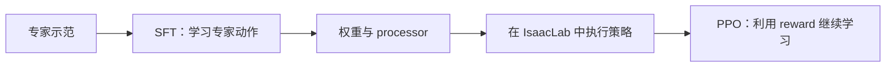
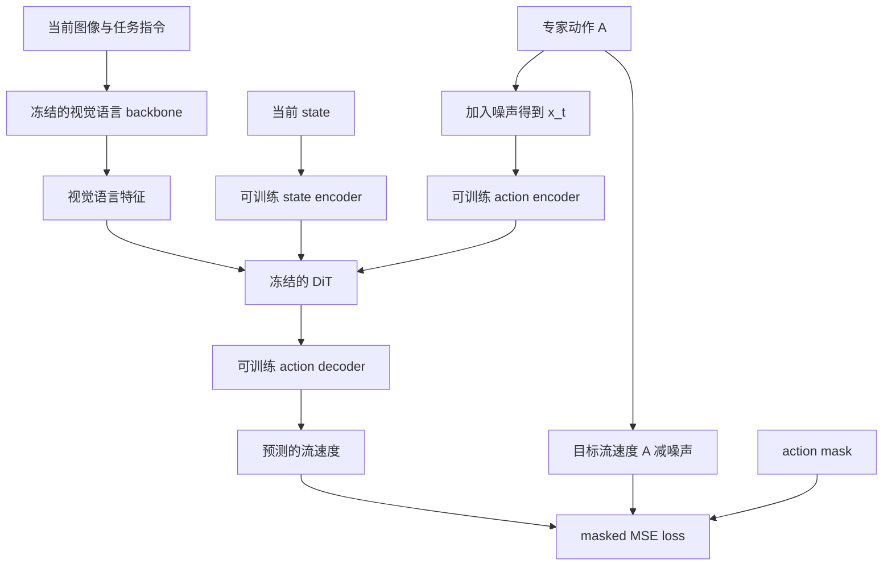

# 从示范数据到一次参数更新：SFT pipeline 调试学习指南

本文面向刚接触具身智能的读者，围绕本项目已经接通的 **GR00T N1.7 + Franka 堆方块微型 SFT** 展开。你可以一边读，一边在 VS Code 中暂停程序，观察“专家做过什么”如何变成模型的训练信号。

学习目标是亲眼跟踪这条链路：

> 示范轨迹 → 取一个训练样本 → 预处理 → 组成 batch → 模型前向 → loss → 反向传播 → 更新参数 → 保存可加载的模型。

当前配置在单张 RTX 4090 上只做 **1 次 projector 参数更新**，但上述计算和保存都是真实的。一次更新用于理解和验证流程，不能据此认为机器人已经学会堆方块。

本文以 2026-10-05 的项目代码为准。张量示例经过真实数据的 CPU loader/processor/collator 检查；训练数值引用已有的 2026-10-02 微型 SFT 记录。撰写本文时没有重新执行 GPU 训练。

## 阅读路线

- [1. SFT 到底在教机器人什么](#1-sft-到底在教机器人什么)
- [2. 先启动一个能看懂的调试会话](#2-先启动一个能看懂的调试会话)
- [3. 代码地图：谁负责哪一段](#3-代码地图谁负责哪一段)
- [4. 第一站：准备模型、processor 和配置](#4-第一站准备模型processor-和配置)
- [5. 第二站：从 episode 中取出一个样本](#5-第二站从-episode-中取出一个样本)
- [6. 第三站：processor 和 collator 如何改变数据](#6-第三站processor-和-collator-如何改变数据)
- [7. 第四站：模型怎样计算训练损失](#7-第四站模型怎样计算训练损失)
- [8. 第五站：反向传播与参数更新](#8-第五站反向传播与参数更新)
- [9. 第六站：保存、加载和评测](#9-第六站保存加载和评测)
- [10. 按断点走完一次完整训练](#10-按断点走完一次完整训练)
- [11. 调试时常见的疑惑](#11-调试时常见的疑惑)
- [12. 复习与进一步阅读](#12-复习与进一步阅读)

第一次可以先读第 1～3 节，再直接按第 10 节的断点表操作。暂停到某一站时，回来读对应的解释。第二遍再深入数据处理和 flow matching 的细节。

## 1. SFT 到底在教机器人什么

### 1.1 从“照着示范学”开始理解

SFT 是 Supervised Fine-Tuning，中文通常叫“监督微调”。这里有两个关键词：

- **监督**：训练数据给出了参考答案，也就是专家在这个场景下采取的动作。
- **微调**：从已经预训练的模型出发，继续调整一部分参数，让它适应当前任务。

想象你在教一个人堆方块。你给他看桌面和手部的照片，告诉他手现在在哪里，再说：“把红块放到蓝块上，然后把绿块放到红块上。”与此同时，你提供一段正确的手部动作作为示范。

机器人训练样本也是如此：

| 日常表达 | 本项目的数据 |
| --- | --- |
| 看看桌面、看看手边 | front 与 wrist 两路 RGB 图像 |
| 手现在在哪里、朝哪里、夹爪开多大 | 8 维机器人 state |
| 这次要完成什么 | 自然语言任务指令 |
| 接下来应该怎么动 | 连续 16 步、每步 7 维的专家 action |

模型学习的是“在这些条件下，应该生成怎样的动作”。机器人领域常把这种从专家示范中学习动作的方式称为 **行为克隆（Behavior Cloning，BC）**。本项目通过微调预训练的 VLA 模型来实现它。

VLA 是 Vision-Language-Action，即视觉、语言、动作。它把“看见什么”和“要做什么”连接到“机器人怎么动”。

### 1.2 一个样本包含现在的观测和未来的动作

用 `k` 表示示范轨迹中的第几个控制时刻，本项目的样本可以写成：

```text
输入条件：图像 I_k + 状态 s_k + 指令 l
监督目标：动作序列 A_k = [a_k, a_(k+1), ..., a_(k+15)]
```

这里的未来动作是**训练目标**。模型推理时只能拿到当前观测和指令，需要自己生成动作。

一次输出一段动作叫 **action chunk**；这段动作的长度叫 **action horizon**。本任务的有效 horizon 是 16，数据频率为 20 Hz，因此一段对应 16 个控制周期，约 0.8 秒。训练中抽取这一段标签，不等于此时让机器人在仿真里执行 0.8 秒。

注意三种不同的“步”：

| 名称 | 含义 | 本项目例子 |
| --- | --- | --- |
| 轨迹帧 / 控制步 | 专家示范中的一个时刻 | 第 `k` 帧 |
| 训练 update / global step | optimizer 更新一次参数 | `max_steps=1` |
| 推理去噪步 | 从随机噪声生成动作的一次迭代 | 默认 4 次 |

所以 `max_steps=1` 并不表示只有 1 帧图像、1 维动作，或只有 1 次推理去噪。

### 1.3 SFT 与 PPO 的位置

SFT 使用已有示范作为答案，训练时不用启动 Isaac Sim，也不需要在线计算 reward。PPO 则让策略在环境里执行动作、收集 reward，再根据执行结果调整策略。



本文聚焦 SFT。理解它之后，再看 PPO 时，你已经知道策略如何读取观测、生成动作，以及模型参数如何更新。

## 2. 先启动一个能看懂的调试会话

### 2.1 使用项目已有的 VS Code 配置

1. 用 VS Code Remote SSH 连接服务器，打开 `embodied-template` 项目根目录。
2. 在远程端安装 Microsoft Python 和 Python Debugger 扩展。
3. 打开“运行和调试”，选择 **`SFT: N1.7 单步训练`**。
4. 先按第 10 节设置断点，然后按 F5 启动。

配置来自 [`.vscode/launch.json`](../.vscode/launch.json)，已经指定：

```text
解释器：.venvs/sft-n1.7/bin/python
入口：scripts/train_stack_cube_sft_micro.py
参数：--output-dir <项目根目录>/tmp/debug/sft
工作目录：项目根目录
```

解释器由 launch 配置直接指定。只要已有环境和资产还在，就无需为了本次学习重新安装依赖或手动切换环境。

`--output-dir` 只指定输出父目录。每次启动会生成独立的时间戳子目录；VS Code 的断点功能由 debugpy 提供，没有额外的 `--debug` 参数。

### 2.2 认识调试器的四个窗口

| 窗口 | 用途 | 适合先看什么 |
| --- | --- | --- |
| Variables / 变量 | 查看当前函数的局部变量 | `config`、`inputs`、`loss` |
| Watch / 监视 | 固定查看表达式 | 当前张量的 `.shape`、`.dtype` |
| Call Stack / 调用堆栈 | 知道当前函数由谁调用 | `Trainer → model → action_head` |
| Debug Console / 调试控制台 | 在选中的暂停帧里执行 Python 表达式 | 小切片、mask 和梯度 |

Debug Console 中变量是否存在，取决于你在 Call Stack 中选中了哪个函数帧。例如在 action head 里有 `actions`，在项目入口里有 `config`；两者不会自动出现在同一个作用域。

常用按键：F5 继续到下一个断点，F10 执行当前行并跨过函数调用，F11 进入函数，Shift+F11 返回调用者。macOS 的功能键可能需要配合 Fn。

**黄色箭头所在行通常还没有执行。** 如果箭头停在 `loss = ...`，先按 F10 才能查看新计算的 `loss`。后文的“计算之后”都按这个规则理解。

### 2.3 本次调试有什么特点

`stopOnEntry=true` 会让程序先停在入口附近。`justMyCode=false` 允许断点进入 `third_party` 和虚拟环境里的 Transformers 源码。

`dataloader_num_workers=0` 表示不创建额外的数据加载进程。但官方 dataset 仍会用**同一进程里的后台线程**预取 shard；数据断点可能命中在另一个线程上。无需像 PPO 那样连接 Ray worker，直接在 Call Stack 中选择命中的线程和函数即可。

第一次到达模型前向前，要经历大文件 SHA256 校验、模型初始化和数据加载。后面保存完整权重、复制 bundle 也可能耗时。不要把“只有一次参数更新”理解成“几秒就能退出”。

## 3. 代码地图：谁负责哪一段

### 3.1 三层代码

把这套 pipeline 分成三层看，会更容易定位：

| 层次 | 负责什么 | 主要文件 |
| --- | --- | --- |
| 项目层 | 固定数据含义、组织本地资产、设置微型训练、打包产物 | [训练入口](../scripts/train_stack_cube_sft_micro.py)、[数据辅助函数](../src/embodied_template/stack_cube.py) |
| GR00T 层 | 创建模型和 dataset、处理多模态输入、计算 flow matching loss | [experiment.py](../third_party/Isaac-GR00T/gr00t/experiment/experiment.py)、[setup.py](../third_party/Isaac-GR00T/gr00t/model/gr00t_n1d7/setup.py)、[模型](../third_party/Isaac-GR00T/gr00t/model/gr00t_n1d7/gr00t_n1d7.py) |
| 训练框架层 | 驱动循环、反向传播、optimizer、scheduler、保存 checkpoint | [Gr00tTrainer](../third_party/Isaac-GR00T/gr00t/experiment/trainer.py)、[本机 Transformers Trainer](../.venvs/sft-n1.7/lib/python3.10/site-packages/transformers/trainer.py) |

项目入口调用的 `run(config)` 就是官方微调入口使用的后端。项目复用了官方训练流程。

### 3.2 实际调用顺序

```text
scripts/train_stack_cube_sft_micro.py::main()
  ├─ 校验源码与资产，创建 staging/initial
  ├─ create_processor()，保存适配 stack-cube 的 processor
  ├─ 创建 staging/train，组装 config
  └─ gr00t.experiment.experiment.run(config)
       ├─ Gr00tN1d7Pipeline.setup()
       │    ├─ _create_model()：加载预训练模型并设置冻结范围
       │    ├─ _create_dataset()：processor + DatasetFactory
       │    └─ _create_collator()
       ├─ 创建 TrainingArguments 和 Gr00tTrainer
       ├─ trainer.train(...)
       │    └─ Transformers Trainer._inner_training_loop()
       │         ├─ get_train_dataloader()
       │         ├─ dataset 取样 → processor → collator
       │         ├─ training_step()
       │         │    ├─ compute_loss() → Gr00tN1d7.forward()
       │         │    │    ├─ backbone.forward()
       │         │    │    └─ action_head.forward() → loss
       │         │    └─ accelerator.backward(loss)
       │         ├─ 梯度裁剪 → optimizer.step() → scheduler.step()
       │         └─ 清梯度 → global_step 加一 → 保存 checkpoint-1
       └─ trainer.save_model()：再次保存最终模型
  └─ 回到项目入口：记录资源、复制 bundle、写 MANIFEST.json
```

`setup.py` 是这里构建训练组件的 Python 模块，进入 `Gr00tN1d7Pipeline.setup()` 时，程序正在初始化模型和数据。

## 4. 第一站：准备模型、processor 和配置

### 4.1 从预训练模型开始

入口读取 `models/gr00t-n1.7-3b`，并把权重文件以软链接放入本次的 `staging/initial/`。这个初始化目录同时放入本任务的模型配置和 processor 文件。

你可以把它理解成一个“本次训练要加载的模型目录”：大权重复用固定资产，数据处理配置使用本任务明确规定的版本。

Cosmos 是视觉语言骨干，运行时路径为 `models/nvidia/Cosmos-Reason2-2B`。这个名字既定位本地资产，也满足固定上游按路径名称选择 backbone 类的逻辑。相关兼容细节见 [微型 SFT 记录](STACK_CUBE_SFT_MICRO.md)。

### 4.2 processor 是模型的输入说明书

模型权重描述“怎样计算”；processor 描述“怎样把数据变成模型能理解的表示”，包括图像处理、语言 tokenization、state/action 的归一化、padding 和 embodiment ID。

例如训练时使用轴角旋转，部署时却把 Euler 角传进去，即使都是三个数字，含义也不同。权重能够加载，不代表输入正确。

因此本项目使用 [data_contract.json](../experiments/stack_cube/sft/data_contract.json) 明确记录数据含义，并把 processor 和统计量随模型一起保存。

固定上游的 processor 重载接口不会接受所有配置覆盖，`use_percentiles` 就不在其覆盖白名单中；官方微调 CLI 还会强制设置 `use_relative_action=true`。所以项目入口先把正确设置写进本地初始化目录，再直接调用官方 `run(config)`，并检查重载后的实际 flags。调试时应查看 `pipeline.processor`，不能只看配置文件里写了什么。

### 4.3 为什么 staging 里还有 train 目录

官方 `DatasetFactory` 会生成统计信息等 metadata。入口把派生训练集的 `meta/` 复制到本次 `staging/train/`，再把 `data/` 与 `videos/` 链接到已有的派生数据。

这样官方训练可以在本次目录里写 metadata，已有的派生数据仍可作为固定输入使用。这里没有重新采集机器人示范。

### 4.4 读取实际生效的配置

[微型配置](../configs/stack_cube_sft_micro.json) 覆盖官方默认值，入口再补充本次的 dataset、初始化目录和输出路径。因此到 `run(config)` 那一行时，观察的 `config` 最接近实际运行设置。

| 设置 | 当前值 | 含义 |
| --- | --- | --- |
| `max_steps` | 1 | 只执行一次 optimizer update |
| `global_batch_size` | 1 | 当前单卡每个 micro batch 含一个样本 |
| `gradient_accumulation_steps` | 1 | 每个 micro batch 后更新一次 |
| `learning_rate` | `1e-4` | 控制 AdamW 的更新尺度 |
| `optim` | `adamw_torch` | 使用 PyTorch AdamW |
| `warmup_ratio` | 0 | 没有学习率预热 |
| `save_steps` / `logging_steps` | 1 / 1 | 本次更新后记录并保存 |
| `save_only_model` | true | 不保存 optimizer/scheduler/RNG 恢复状态 |
| `num_gpus` / `dataloader_num_workers` | 1 / 0 | 单卡，没有 DataLoader 子进程 |
| `use_percentiles` / `use_relative_action` | false / false | 用 min/max；不额外把动作转换成相对量 |
| `state_dropout_prob` | 0 | 保留 state 输入 |

当前官方默认值还补充了 `bf16=true`、`fp16=false`、`max_grad_norm=1.0`、`weight_decay=1e-5`、`lr_scheduler_type="cosine"`、`eval_strategy="no"`。这些值不一定都写在项目 JSON 中，暂停时仍可以在 `config.training` 查看。

BF16 是一种较省显存的浮点格式。输入处理阶段的浮点 tensor 通常是 CPU float32，进入训练后会经过设备迁移、模型 dtype 转换和混合精度上下文。不要假定每个参数、每个中间结果都具有相同 dtype，直接查看 `.dtype`。

在这个上游实现里，effective batch 可以按以下方式理解：

```text
每次更新使用的样本数
  = 每卡 micro batch × GPU 数 × gradient accumulation
  = 1 × 1 × 1 = 1
```

其 `per_device_train_batch_size` 由 `global_batch_size // num_gpus` 得到，gradient accumulation 另行传给 Trainer。以后修改累积次数时，应同时核对 `TrainingArguments`，不要只凭 `global_batch_size` 的名称推断。

### 4.5 本次到底训练哪些参数

当前只打开 `tune_projector=true`。这里的 projector 包含多组 action head 模块：

| 模块 | 职责 | 本次更新？ |
| --- | --- | --- |
| 视觉语言 backbone | 提取图像和任务指令特征 | 否 |
| `action_head.state_encoder` | 把 state 映射成内部特征 | 是 |
| `action_head.action_encoder` | 编码带噪动作与噪声时间 | 是 |
| `action_head.action_decoder` | 把内部特征映射成预测的流速度 | 是 |
| `action_head.position_embedding` | 表示动作在序列中的位置 | 是 |
| `action_head.model`，即 DiT | 用视觉、语言和 state 条件处理动作序列 | 否 |
| `vlln` 与相关视觉语言特征处理模块 | 处理 backbone 特征 | 否 |

“冻结”的核心是参数 `requires_grad=False`，optimizer 不更新它。**冻结模块仍然参与前向计算**；如果它位于可训练模块之后，还可能需要通过它把梯度传回前面的模块。这一点在第 8 节会用例子说明。

已有运行记录中，总参数量为 3,144,016,000，可训练 projector 参数为 327,356,544，约 10.41%。这些可训练参数包含多种 embodiment 的参数组，不等于每个参数元素都在这个单样本中获得非零梯度。

本地微型配置与正式训练规划不同：正式 SFT 计划训练完整 action head，包含 DiT 和 vlln。先用当前配置学习即可，详细规划见 [TRAINING_PIPELINE.md](TRAINING_PIPELINE.md)。

## 5. 第二站：从 episode 中取出一个样本

### 5.1 episode、frame 和 shard

**Episode** 是一次完整示范轨迹，比如机械臂从初始状态开始，依次堆放三个方块。**Frame** 是这段轨迹中的一个时刻，包括图像、状态、动作和任务信息。

数据采用 LeRobot 格式，数值存在 parquet 文件里，图像存在视频里，`meta/` 记录字段如何对应。SFT 实际使用 `runs/stack-cube/data/train` 中的**转换后数据**。

原始数据共 147 条 episode、53,265 帧。固定划分为 117 train、15 validation、15 test，按整条 episode 划分。若把同一轨迹的相邻帧随机分到训练和验证，两者会非常相似，使验证更难反映对新轨迹的表现。

**Shard** 是官方 dataset 为加载和缓存组织的一组样本。它不是另一次机器人任务，也不一定只包含一条 episode。Dataset 会把不同轨迹中的起始帧分配到 shard 中，再打乱 shard 内的样本。

当前 `shard_size=64` 是分块的目标大小，batch 仍是 1。`episode_sampling_rate=0.1` 在这个固定实现中用于把 episode 的起始帧分成 10 组再分配到 shard；不能直接理解成“训练集只留下了 10% 的帧”。`num_shards_per_epoch=1` 控制采样调度，而这次何时停止最终由 `max_steps=1` 决定。

### 5.2 state 和 action 的每一维

8 维 state 描述当前机械臂末端和夹爪：

```text
[eef_x, eef_y, eef_z,
 rotvec_x, rotvec_y, rotvec_z,
 left_finger_pos, -right_finger_pos]
```

其中 EEF 是 end effector，即末端执行器，可以理解为机械臂手部。xyz 是位置；rotvec 是旋转向量（轴角），方向表示旋转轴，长度表示角度，使用主分支，角度不超过 π。最后两项是夹爪手指位置。

原始数据的旋转经项目核对按 Euler xyz 解释，派生数据将它转换为 rotvec。字段名还叫 `roll/pitch/yaw` 时，也要依据 contract 理解其数值；字段名称不会自动保证旋转表示正确。转换代码在 `convert_dataset_state()`。

7 维 action 是给环境的相对 IK 命令：

```text
[delta_x / 0.5, delta_y / 0.5, delta_z / 0.5,
 delta_rotvec_x / 0.5, delta_rotvec_y / 0.5, delta_rotvec_z / 0.5,
 gripper_sign]
```

IK 是 inverse kinematics，逆运动学：由期望的末端位姿求关节控制量。模型这里学习末端命令，不直接预测整组机械臂关节角。

按当前固定 runtime contract，环境对前 6 维乘 `0.5`。例如 x 动作命令 `0.02` 对应 x 方向约 `0.01 m` 的目标位移。这是 IK **目标**的位移，不保证执行后的实际位移完全等于它。第 7 维 `+1` 打开夹爪，`-1` 关闭，环境把 0 解释为打开。

当前 SFT 保留数据中的命令值，不预乘环境的 `0.5` scale，也不把命令再次减去当前 state。`use_relative_action=false` 控制的是 processor 是否额外做转换；**数据本身仍然是相对 IK 命令**。

公开示范缺少完整的采集参数，本文对动作执行的解释遵循项目已验证的 runtime contract；原始采集信息的边界保留在 [数据验证记录](STACK_CUBE_DATA_CONTRACT.md) 中。

### 5.3 取一个训练样本的源码

重点看 [sharded_single_step_dataset.py](../third_party/Isaac-GR00T/gr00t/data/dataset/sharded_single_step_dataset.py) 中的 `get_datapoint()` 与 `extract_step_data()`：

```python
vla_step_data = extract_step_data(
    episode_data,
    step_index,
    self.modality_configs,
    self.embodiment_tag,
    self.allow_padding,
)
messages = [{"type": MessageType.EPISODE_STEP.value, "content": vla_step_data}]
return self.processor(messages)
```

`extract_step_data()` 依据 modality 的 `delta_indices` 决定取哪些帧：图像和 state 取 `[0]`，动作取 `[0,1,...,15]`。这里的 delta 相对当前 `step_index`。

例如 `step_index=100`：

```text
front / wrist 图像：第 100 帧
state：第 100 帧，拼接后 (1, 8)
action：第 100～115 帧，拼接后 (16, 7)
text：当前任务指令
```

`VLAStepData` 只是把这些字段组织在一起，下一步由 processor 转换成模型输入。暂停在 `messages = ...` 那行时，`vla_step_data` 已经存在，可以观察 `states`、`actions`、`images`、`text` 和 `embodiment`。

### 5.4 为什么末尾少了 15 个起始帧

对长度为 `L` 的 episode，能取出完整 16 步动作的起始位置共有：

```text
L - 16 + 1 = L - 15
```

官方训练的 `get_effective_episode_length()` 使用这个长度，所以不把最后 15 个起始帧作为训练样本，**即使 `allow_padding=true` 也是如此**。

显式调用 `extract_step_data(..., allow_padding=True)` 可以越过末尾并重复最后一个动作，但这段边界处理不会生成“重复动作无效”的 mask。它与后面为了适配模型大小而进行的零 padding 是两件不同的事。

## 6. 第三站：processor 和 collator 如何改变数据

### 6.1 先统一数值尺度

位置、旋转、夹爪的数值范围不同。归一化把每一维映射到较一致的尺度，便于模型处理。

本项目使用 **train-only min/max normalization**。对于非恒定维度，变换为：

```text
归一化：x_norm = 2 × (x - min) / (max - min) - 1
反归一化：x = (x_norm + 1) / 2 × (max - min) + min
```

举个纯教学例子：如果某维训练数据范围为 `[0.2, 0.6]`，那么 `0.2 → -1`、`0.4 → 0`、`0.6 → +1`。恒定维度由官方实现编码为 0，解码回该常量。

统计量由转换后的 117 条训练 episode 计算，validation/test 使用同一套统计量。这样验证数据不会参与决定输入的缩放方式。相关代码在 [StateActionProcessor](../third_party/Isaac-GR00T/gr00t/data/state_action/state_action_processor.py) 与 [归一化函数](../third_party/Isaac-GR00T/gr00t/data/utils.py)。

当前 `use_percentiles=false`，所以不使用 q01/q99 作为边界；`use_mean_std=false`，所以也不使用均值/标准差归一化。保留的 clipping 会将超出范围的值截到边界，因此不能承诺所有 validation/runtime 数值都能无损往返。

### 6.2 8 维和 7 维为什么变成 132 维

GR00T 支持多种机器人，使用统一的较大输入空间。本任务先保留实际 state/action，再把未使用的位置补 0：

| 阶段 | state | action | action mask |
| --- | --- | --- | --- |
| 从轨迹取出并拼接 | `(1, 8)` | `(16, 7)` | 尚未生成 |
| processor 输出单样本 | `(1, 132)` | `(40, 132)` | `(40, 132)` |
| collator 输出 batch=1 | `(1, 1, 132)` | `(1, 40, 132)` | `(1, 40, 132)` |

三个轴可以分别理解为：

```text
state:  (batch 中的样本数, state 历史帧数, 模型容纳的 state 维度)
action: (batch 中的样本数, 模型容纳的动作步数, 模型容纳的动作维度)
```

其中 `132` 是模型容量，不是机械臂有 132 个关节；`40` 是模型内部 horizon，不是本任务提供了 40 步专家标签。本任务仍只有 16×7 个有效动作数值。

`action_mask` 相当于告诉 loss：“这些格子才有参考答案。”其有效区域如下：

```text
                   动作维度
               0～6       7～131
动作步  0～15     1            0
       16～39     0            0
```

因此单样本 `action_mask.sum()` 应为 `16 × 7 = 112`。padding 区域不直接计入监督损失，但模型前向仍会处理完整张量。

训练时加噪之后，padding 区域的带噪动作未必还是 0；监督是否有效由 mask 决定。不要只通过“数值是不是 0”判断有没有标签。

### 6.3 图像和语言是怎样进入模型的

在 [Gr00tN1d7Processor.__call__()](../third_party/Isaac-GR00T/gr00t/model/gr00t_n1d7/processing_gr00t_n1d7.py) 中，图像会经过训练用变换，任务指令会按配置规范化，然后组织成含图像和文字的 `vlm_content`。

接下来 `Gr00tN1d7DataCollator.__call__()` 完成两件事：

1. 把单样本的 state、action、mask 等沿 batch 维堆起来。
2. 调用 Cosmos/Qwen 的多模态 processor，把文字和图像转换成 backbone 输入。

你会看到：

| 字段 | 用途 |
| --- | --- |
| `input_ids` | 文本与多模态特殊 token 的整数编号 |
| `attention_mask` | 指出哪些 token 位置属于有效输入 |
| `pixel_values` | 图像按视觉模型要求整理后的浮点数据 |
| `image_grid_thw` | 描述图像在时间、高、宽方向的网格结构 |
| `embodiment_id` | 指定使用哪一组机器人相关参数 |

`pixel_values` 不必是熟悉的 `(B,3,H,W)`，Qwen 视觉处理会把图像整理成 patch 表示。本文 CPU 单样本检查得到 `(512,1536)`，`input_ids=(1,154)`，`image_grid_thw=(2,3)`；这是一次具体检查的结果。语言长度、图像处理设置等会影响这些尺寸。

`embodiment_tag="libero_sim"` 在这里标记复用的输入 schema 和 projector 参数组，ID 是 2。当前数据来自 IsaacLab 堆方块示范；这个标签不表示 SFT 启动了 LIBERO 仿真。

### 6.4 batch 外面还有一层 `inputs`

collator 返回的结构是：

```python
{
    "inputs": {
        "state": ...,
        "action": ...,
        "action_mask": ...,
        "embodiment_id": ...,
        "input_ids": ...,
        "attention_mask": ...,
        "pixel_values": ...,
        "image_grid_thw": ...,
    }
}
```

这是调试中很容易混淆的一点：

- 在 `Gr00tTrainer.compute_loss()` 中，形参 `inputs` 是**外层**字典，要用 `inputs["inputs"]["action"]`。
- 在 `Gr00tN1d7.forward()` 中，形参 `inputs` 已是**内层**字典，要用 `inputs["action"]`。

原因是父类 Trainer 调用 `model(**inputs)`，将外层唯一的键 `inputs` 作为参数传给模型的 `forward(inputs: dict)`。

## 7. 第四站：模型怎样计算训练损失

### 7.1 一次前向的两部分

[Gr00tN1d7.forward()](../third_party/Isaac-GR00T/gr00t/model/gr00t_n1d7/gr00t_n1d7.py) 的主要代码非常短：

```python
backbone_inputs, action_inputs = self.prepare_input(inputs)
backbone_outputs = self.backbone(backbone_inputs)
action_outputs = self.action_head(backbone_outputs, action_inputs)
return action_outputs
```

`prepare_input()` 做设备和 dtype 转换，backbone 提取图像与语言特征，action head 再结合 state 和带噪动作计算 loss。



暂停在 backbone 调用之后，查看 `backbone_outputs.backbone_features.shape`。通常是 `(B, token数, 特征宽度)`，表达图像和任务语义，已经不是原始像素。

### 7.2 为什么训练时需要噪声

N1.7 action head 使用 **flow matching（流匹配）**。直观上，它学习一个方向场：给定当前场景和一段带噪动作，告诉你应该往哪个方向改变它，才能逐渐得到合适的动作。

先用一个一维教学例子理解。假设归一化后的专家动作是 `A=0.6`，抽到的噪声是 `ε=-0.4`。从噪声到答案的直线为：

```text
x_t = (1-t) × ε + t × A

t=0：   x_t=-0.4，纯噪声端
t=0.5： x_t= 0.1，中间位置
t=1：   x_t= 0.6，专家动作端

沿这条直线的目标变化方向：v = A-ε = 1.0
```

模型收到中间位置 `x_t`、时间 `t`、图像、语言和 state，学习预测变化方向 `v`。实际动作是高维序列，公式对每个位置同时应用。

### 7.3 与源码逐行对应

在 `Gr00tN1d7ActionHead.forward()` 中：

```python
actions = action_input.action
noise = torch.randn(actions.shape, device=actions.device, dtype=actions.dtype)
t = self.sample_time(actions.shape[0], device=actions.device, dtype=actions.dtype)
t = t[:, None, None]

noisy_trajectory = (1 - t) * noise + t * actions
velocity = actions - noise
```

逐个对照：

| 源码变量 | 理论符号 | 解释 | 当前形状 |
| --- | --- | --- | --- |
| `actions` | A | 归一化并补齐后的专家动作 | `(1,40,132)` |
| `noise` | ε | 同形状的标准正态噪声 | `(1,40,132)` |
| `t` | t | 噪声到答案之间的位置 | `(1,1,1)` |
| `noisy_trajectory` | x_t | 噪声与专家动作的插值 | `(1,40,132)` |
| `velocity` | v | 需要预测的方向 `A-ε` | `(1,40,132)` |

这个 `velocity` 是**动作空间中沿噪声路径的变化率**，不是机械臂在物理空间中的运动速度。

`t` 也不是示范的第几帧。示范时间用前面的 `k` 或代码中的 `step_index` 表示；这里的 `t` 表示噪声插值位置。上游 `sample_time()` 从 Beta 分布采样后做 `(1-sample)×noise_s` 变换，不能把它理解成每次固定 0.5 或均匀采样。

之后，`t_discretized` 把连续的 `t` 转成离散时间桶，action encoder 编码带噪动作，position embedding 表示动作在序列里的位置。state 特征与动作特征拼接后进入 DiT，并以视觉语言特征作为条件。

action decoder 的输出切出动作部分：

```python
pred = self.action_decoder(model_output, embodiment_id)
pred_actions = pred[:, -actions.shape[1]:]
```

虽然变量叫 `pred_actions`，**它在这个训练函数里预测的是 flow velocity**。不要直接把它当成反归一化之后可以发给机器人的 7 维动作。

### 7.4 loss 在比较什么

源码最后计算：

```python
action_mask = action_input.action_mask
action_loss = F.mse_loss(pred_actions, velocity, reduction="none") * action_mask
loss = action_loss.sum() / (action_mask.sum() + 1e-6)
```

MSE 是 mean squared error，均方误差。这里先逐元素算平方差，再乘 mask，最后仅对有效格子取平均：

```text
loss = 有效格子中的 (预测流速度 - 目标流速度)² 之和
       / 有效格子数量
```

例如某个有效格子的目标流速度为 1.0、预测为 0.7，那么它贡献 `(0.7-1.0)²=0.09`。单样本共有 112 个有效格子；其他 padding 格子不直接贡献 loss。

训练返回的 `outputs` 包含 `loss`、`action_loss`、`action_mask` 和部分中间特征。`loss` 是用于反向传播的标量 tensor，通常 `shape=()`、`requires_grad=True`。

**训练 loss 与 open-loop 动作 MSE 含义不同。** 前者衡量归一化动作空间中的流速度误差，后者比较生成并解码后的动作与专家命令。因此二者的数值不能直接比较，也没有“loss=1.5 就表示位置误差 1.5 米”的解释。

## 8. 第五站：反向传播与参数更新

### 8.1 前向、反向、更新是三个动作

先把训练循环写成教学伪代码：

```python
# 仅用于理解；实际流程由 Trainer 和 Accelerate 执行。
outputs = model(batch)           # 前向：根据当前参数计算结果
loss = outputs["loss"]
loss.backward()                 # 反向：算出参数对 loss 的影响
clip_grad_norm_(parameters, 1.0)
optimizer.step()                # 更新：依据梯度改变参数
scheduler.step()                # 为后续更新调整学习率
model.zero_grad()               # 清除本次梯度
```

**梯度**可以理解成“这个参数稍微变化，会让 loss 朝哪个方向变化、变化多快”。`backward()` 计算这种信息，放入参数的 `.grad`。它本身不更新参数值。

最简单的梯度下降可写作 `参数_new = 参数_old - 学习率 × 梯度`。本项目使用 AdamW，会考虑梯度的历史统计，并应用权重衰减；不能用这个简单公式逐元素精确预测实际更新。

### 8.2 反向传播在哪里发生

`Gr00tTrainer.compute_loss()` 只获取模型算出的 loss，并记录 `self.loss`。真正的反向发生在本机 Transformers 源码的 `Trainer.training_step()` 中：

```python
loss = self.compute_loss(model, inputs, ...)
# ...按当前 gradient accumulation 规则处理 loss...
self.accelerator.backward(loss, **kwargs)
return loss.detach()
```

`Accelerate` 是 Trainer 使用的设备和训练执行辅助库。此处的 backward 最终调用 PyTorch 自动求导。

如果你在 `compute_loss()` 返回前观察参数，`.grad` 尚未由本次反向计算填充。把断点移到 `training_step()` 的 `return loss.detach()`，此时 backward 已执行，但 optimizer 还没有更新。

### 8.3 optimizer 更新在哪里发生

`optimizer.step()` 在 `Trainer._inner_training_loop()`，不在上面的 `training_step()` 里。真实顺序是：

```text
training_step() 计算 loss 并反向
  → 梯度裁剪
  → optimizer.step()
  → scheduler.step()
  → model.zero_grad()
  → global_step += 1
  → 记录并保存
```

梯度裁剪限制梯度的整体长度，当前阈值为 1.0。已有日志的 `grad_norm=1.2691` 可以是裁剪前的范数，超过 1.0 不表示裁剪没生效。

在 `optimizer.step()` 之前，loss 已经算出来，但权重尚未更新；按 F10 越过该调用后，才应该查看权重差。随后梯度会被清除，所以训练结束时 `.grad is None` 也不能说明没有执行过反向。

### 8.4 冻结 DiT 为什么还能训练 encoder

考虑一个简化公式：

```text
y = w × x
```

即使固定 `w`，仍然可以计算 y 对 x 的变化率。对应到模型中，冻结 DiT 的**参数**，仍可计算其输出对输入特征的导数，让 loss 的梯度回传到可训练的 state/action encoder。

所以这几个概念要分别理解：

| 操作 | 作用 |
| --- | --- |
| `requires_grad=False` | 该参数不累积训练梯度 |
| `eval()` | 改变 dropout 等模块的行为 |
| `torch.no_grad()` | 在上下文中不记录用于自动求导的计算图 |

`eval()` 不会自动关闭梯度，`model.train()` 也不会自动把冻结参数解冻。在这里给整个 action head 包上 `no_grad()`，会阻断本应存在的训练梯度。

### 8.5 亲眼看到一小片权重发生变化

这个练习可在第 10 节的 optimizer 断点完成，无需修改训练源码。

在 HF `Trainer._inner_training_loop()` 的 `self.optimizer.step()` 行暂停，先在 Debug Console 中逐行执行：

```python
self._sft_probe_w = self.accelerator.unwrap_model(model).action_head.action_decoder.layer2.W
self._sft_probe_before = self._sft_probe_w[2, :, :7].detach().float().cpu().clone()
self._sft_probe_w.requires_grad
self._sft_probe_w.grad[2, :, :7].float().norm().item()
self.state.global_step
```

此时预期：参数可训练，梯度已经存在，`global_step=0`。选择 ID=2 的参数组，是因为本任务 `libero_sim` 使用它；`:7` 只看实际动作的七个输出维度。只复制这一小片，避免把整个模型复制到内存。

按 F10 越过 `self.optimizer.step()`。若进入了其他已设置断点，先继续到该调用返回。然后执行：

```python
(self._sft_probe_w[2, :, :7].detach().float().cpu() - self._sft_probe_before).abs().max().item()
```

这个最大绝对差若大于 0，就直接证明这片参数有实际变化。只观察 `requires_grad=True` 或非零 loss，都不能单独证明 optimizer 已更新权重。

这里把小快照放在同一个 Trainer 对象上，便于跨语句查看。它只用于本次调试，不会写入模型权重。继续执行到 `global_step += 1` 之后，会看到 `global_step=1`。

## 9. 第六站：保存、加载和评测

### 9.1 输出目录里有什么

使用当前 F5 配置，产物位于：

```text
tmp/debug/sft/<时间戳>/
├── staging/
│   ├── initial/              本次初始化目录：权重链接 + 配置 + processor
│   └── train/                metadata 副本与数据/视频链接
├── training/
│   ├── checkpoint-1/         step 1 权重、trainer_state、processor 等
│   ├── processor/            官方保存的 processor 文件
│   ├── experiment_cfg/       实际运行配置与统计信息
│   └── ...                   最终模型权重、配置等
├── training-resources.json   run 的耗时和 CUDA 内存记录
└── bundle/
    ├── checkpoint/           从 checkpoint-1 复制的模型
    ├── processor/
    ├── experiment_cfg/
    ├── LICENSE
    └── MANIFEST.json          资产版本、数据与文件校验信息
```

训练到第 1 步时，Trainer 保存 `checkpoint-1`，`CheckpointFormatCallback.on_save()` 将 processor 和配置复制进去。训练结束后还会 `trainer.save_model()`，再由项目入口复制出 bundle。

虽然只训练 projector，当前保存的是完整模型权重，而不是一小份 projector 增量。已有 bundle 约 8.9 GiB；本次输出还包含训练保存和 bundle 副本，所以保存和打包明显慢于一次 GPU update 是合理的。

`training-resources.json` 的 wall time 从 `run(config)` 前开始计时，包含官方初始化、训练和保存；调试暂停时间也会计入。它不包含之后的 bundle 复制和 hash。`peak_allocated` 是 PyTorch 实际分配峰值，`peak_reserved` 是其缓存分配器保留峰值，两者不必相等。

### 9.2 初始化权重与恢复训练不同

这两个名字很容易混淆：

| 设置 / 调用 | 做什么 |
| --- | --- |
| `start_from_checkpoint=staging/initial` | 初始化模型和 processor |
| `trainer.train(resume_from_checkpoint=True)` | 尝试从训练输出目录中的最新 checkpoint 恢复 |

官方 `Gr00tTrainer.train()` 会先找 `output_dir` 下的 checkpoint。当前 F5 每次使用新的时间戳目录，里面没有旧 checkpoint，所以开始新的 step 0。出现 `No valid checkpoint found` 的提示在这里通常符合预期。

此外，本次 `save_only_model=true` 不保存 optimizer、scheduler 和 RNG 状态。这个产物可以用于推理，或作为后续训练的模型初始化；不能据此完整恢复 SFT 的 optimizer 进度。`trainer_state.json` 记录了 step，不等于所有训练状态都保存了。

### 9.3 学会查看成功完成的证据

可以按三个层次判断：

| 证据 | 能说明什么 |
| --- | --- |
| `trainer_state.json` 中 `global_step=1`，loss/grad norm 有限 | 训练框架走到了一个 update |
| decoder 权重与初始化值实际不同 | 至少检查到的参数确实改变 |
| 新进程成功加载 checkpoint 和 processor，输出有限的 `(16,7)` 动作 | 保存与加载接口能用 |

这些证据仍然不等于任务成功。已有微型 SFT 记录为 loss `1.5655`、grad norm `1.2690935`，decoder 检查到 5,250 个元素变化，最大变化约 `1e-4`。数值来自既有运行，本次调试受随机状态、精度和环境影响，不要求逐位相同。

### 9.4 训练的 flow velocity 怎样变成推理动作

推理时没有专家动作，模型先从随机噪声开始，反复预测流速度并小幅更新动作：

```python
# 简化示意，实际代码在 get_action_with_features()。
actions = random_noise
for j in range(4):
    predicted_velocity = model_given_observation(actions, noise_time=j / 4)
    actions = actions + 0.25 * predicted_velocity
```

对应源码是 `actions = actions + dt * pred_velocity * vel_strength`。普通推理中 `vel_strength` 为 1。注意这 4 次生成迭代和训练的 `max_steps=1` 没有数量关系。

最终模型内部仍输出 `(B,40,132)`，`processor.decode_action()` 取有效的前 16 步、前 7 维，再使用训练统计量反归一化，得到 `(B,16,7)` 的命令。随后环境 adapter 才会把这些命令交给机器人控制器。

### 9.5 open-loop 与 closed-loop

**Open-loop 评测**始终使用示范中的真实观测，让模型生成动作，再与专家动作比较。机器人没有执行这些预测，因此它不会因为预测错误而进入新的状态。

**Closed-loop 评测**让机器人真正执行预测动作，并使用执行后产生的新观测继续控制。偏差会累积，模型需要在自己造成的状态中继续完成任务，所以才更接近“机器人有没有学会”。

当前 F5 配置只启动 Python 训练入口，完成 update、保存和 bundle，不自动运行 offline verifier 或 IsaacLab rollout。已有 [验收脚本](../scripts/verify_stack_cube_sft_micro.py) 与 shell runner 固定读取 `models/stack-cube-n1.7-sft`；不要运行它们后误以为验收的是刚生成的 `tmp/debug/sft/.../bundle`。

同样，现有 PPO 调试配置默认加载已有的 `models/stack-cube-n1.7-sft/checkpoint`，不会自动选择这次 SFT 调试输出。

你可以先查看已有的 held-out episode 6 对比图 `runs/stack-cube/visualization/open-loop/micro-episode-000006.png`。已有记录的总体动作 MSE 约 0.2316，夹爪误差较大；roll/pitch 标签为常量 0，相应零误差也不能证明模型掌握了旋转控制。完整数值和验收方法见 [STACK_CUBE_SFT_MICRO.md](STACK_CUBE_SFT_MICRO.md)。

## 10. 按断点走完一次完整训练

### 10.1 第一遍只设置这 7 个断点

VS Code 中用 Ctrl+P 打开文件，Ctrl+G 跳到行号，在可执行代码行左侧点击设置断点。以下行号对应本文检查的版本；如果文件变化，以“断点位置”列中的语句为准。

为缩短表格，定义路径简称：

```text
GR = third_party/Isaac-GR00T/gr00t
HF = .venvs/sft-n1.7/lib/python3.10/site-packages/transformers/trainer.py
```

| 顺序 | 文件与参考行号 | 断点位置 | 这次停下要回答什么 |
| --- | --- | --- | --- |
| ① | `scripts/train_stack_cube_sft_micro.py:117` | `run(config)`，调用前 | 本次输入、输出、更新次数是什么？ |
| ② | `GR/experiment/experiment.py:190` | `model = pipeline.return_model()`，setup 之后 | 哪些参数可训练？模型和 processor 是否建好？ |
| ③ | `GR/experiment/trainer.py:304` | `loss, outputs = super().compute_loss(...)`，调用前 | batch 的真实结构与形状是什么？ |
| ④ | `GR/model/gr00t_n1d7/gr00t_n1d7.py:264` | `loss = action_loss.sum() / ...` | 本次在预测什么？mask 的有效区域是什么？ |
| ⑤ | `HF:4073` | `return loss.detach()`，backward 之后 | 哪些参数已经有梯度？ |
| ⑥ | `HF:2740` | `self.optimizer.step()`，更新前 | 越过这行后权重是否改变？ |
| ⑦ | `scripts/train_stack_cube_sft_micro.py:135` | `checkpoint = report / ...`，run 返回之后 | step 1 是否保存，接下来 bundle 放在哪里？ |

先设置这些断点，再 F5。入口暂停时按 F5 到①；后面用 F5 在关键站点间移动，用 F10 完成少量必要语句。无需一路 F11 跟进库的所有内部函数。

### 10.2 每一站的 Debug Console 表达式

**① 项目入口：**箭头在 `run(config)` 时执行：

```python
config.training.max_steps
config.training.global_batch_size
config.training.gradient_accumulation_steps
config.training.start_from_checkpoint
config.training.output_dir
config.data.datasets
config.model.tune_projector
config.model.tune_diffusion_model
```

预期更新次数、batch、累积次数都是 1；初始化路径指向本次 staging，训练输出指向本次时间戳目录。这里 `config.data.datasets` 指向的是 staging 中的 train 目录。

**② pipeline setup 之后：**当前帧是官方 `experiment.run()`。`model` 那行尚未执行，可通过 `pipeline` 观察：

```python
type(pipeline).__name__
sum(p.numel() for p in pipeline.model.parameters())
sum(p.numel() for p in pipeline.model.parameters() if p.requires_grad)
next(pipeline.model.action_head.action_decoder.parameters()).requires_grad
next(pipeline.model.action_head.model.parameters()).requires_grad
pipeline.processor.use_percentiles
pipeline.processor.use_relative_action
```

预期 pipeline 为 `Gr00tN1d7Pipeline`，decoder 可训练，DiT 参数冻结，两个 processor flags 为 false。按 F10 后才有本帧的局部变量 `model`。

**③ Trainer 收到 batch：**在 `Gr00tTrainer.compute_loss()` 里执行：

```python
list(inputs.keys())
{k: (tuple(v.shape), str(v.dtype), str(v.device)) for k, v in inputs["inputs"].items()}
inputs["inputs"]["action_mask"].sum().item()
inputs["inputs"]["embodiment_id"].tolist()
inputs["inputs"]["state"][0, 0, :8].detach().float().cpu().tolist()
inputs["inputs"]["action"][0, :2, :7].detach().float().cpu().tolist()
```

预期外层只有 `inputs`；state `(1,1,132)`，action/mask `(1,40,132)`，mask 总和 112，ID 为 `[2]`。看到的 state/action 已经归一化，不能直接按原始单位解释。

这个断点位于父类 `compute_loss()` 调用前；调用会经过模型前向，命中④。以后回到③并越过父类调用后，可看 `list(outputs.keys())` 与 `loss.item()`。

**④ action head 计算 loss：**箭头在 loss 赋值行时，先观察已有变量：

```python
tuple(actions.shape)
tuple(t.shape)
t.detach().float().cpu().flatten().tolist()
actions[0, 0, :7].detach().float().cpu().tolist()
noise[0, 0, :7].detach().float().cpu().tolist()
velocity[0, 0, :7].detach().float().cpu().tolist()
tuple(pred_actions.shape)
action_mask.sum().item()
```

尝试用一个格子的数值验证 `velocity=actions-noise`。然后 F10 执行 loss 那行：

```python
loss.item()
tuple(loss.shape)
loss.requires_grad
torch.isfinite(loss).item()
```

预期是有限标量，`shape=()`，需要梯度。此时还没有执行本次 backward。

**⑤ backward 之后：**在 HF `training_step()` 的返回行查看：

```python
next(model.action_head.action_decoder.parameters()).grad is None
next(model.action_head.model.parameters()).grad is None
self.state.global_step
```

当前单卡配置下，第一个通常为 false，第二个为 true，step 仍为 0：可训练 decoder 已有梯度，冻结 DiT 参数没有梯度，optimizer 尚未更新。

**⑥ optimizer：**按第 8.5 节保存小片权重，F10 越过更新，比较差值。继续 F10 到 `self.state.global_step += 1` 并执行它，此时 step 应为 1。观察当前学习率可用：

```python
self.optimizer.param_groups[0]["lr"]
```

cosine scheduler 在这次唯一 update 完成后可能把下一步学习率降到 0，这不表示刚才那次 update 使用了 0。已有日志记录该次更新使用的学习率为 `1e-4`。

**⑦ run 返回后：**此时训练资源记录已写出，`checkpoint-1` 已存在，bundle 尚在打包过程：

```python
report
bundle
read_json(report / "training/checkpoint-1/trainer_state.json")["global_step"]
read_json(report / "training/checkpoint-1/trainer_state.json")["log_history"]
```

继续 F5 到程序结束，看到 `Bundle saved at ...`，再查看该目录的 `MANIFEST.json` 和 `bundle/checkpoint/`。

### 10.3 第二遍深入数据链路

熟悉第一遍后，可以再启动一次独立的 SFT 调试，增加下列断点。数据预取会处理多个样本，所以这些断点可能多次命中；看清一个样本后，暂时禁用数据断点，继续到模型前向。

| 文件 | 函数与暂停位置 | 观察对象 |
| --- | --- | --- |
| `GR/experiment/trainer.py` | `get_train_dataloader()` 的返回前 | `self.train_dataset`、`dataloader_params` |
| `GR/data/dataset/sharded_single_step_dataset.py` | `get_datapoint()`，`extract_step_data()` 返回后 | `step_index`、`vla_step_data` |
| `GR/model/gr00t_n1d7/processing_gr00t_n1d7.py` | processor 的 `__call__()`，返回前 | `normalized_states`、`normalized_actions`、`action_mask`、`vlm_inputs` |
| 同上 | `Gr00tN1d7DataCollator.__call__()`，返回前 | `features`、`batch` |
| `GR/model/gr00t_n1d7/gr00t_n1d7.py` | `Gr00tN1d7.forward()`，backbone 调用后 | `backbone_inputs`、`action_inputs`、`backbone_outputs` |

在 `get_datapoint()` 的局部变量已经生成后，可以执行：

```python
step_index
vla_step_data.text
{k: v.shape for k, v in vla_step_data.states.items()}
{k: v.shape for k, v in vla_step_data.actions.items()}
{k: (len(v), v[0].shape) for k, v in vla_step_data.images.items()}
```

在 processor 返回前，可以执行：

```python
normalized_states.shape
normalized_actions.shape
action_mask.sum().item()
torch.count_nonzero(normalized_states[:, 8:]).item()
torch.count_nonzero(normalized_actions[16:, :]).item()
```

预期 state `(1,132)`、action `(40,132)`、mask 总和 112；上述两个 padding 区域中非零元素数为 0。这里处于加入训练噪声之前。

在 collator 返回前，可以执行：

```python
len(features)
{k: (tuple(v.shape), str(v.dtype)) for k, v in batch.items()}
```

这能亲眼证明“单样本增加 batch 维”发生在哪一层。第一遍③看到的外层 `inputs` 包装，也是这个返回值建立的。

## 11. 调试时常见的疑惑

| 现象 / 疑惑 | 原因与查看方式 |
| --- | --- |
| F5 后迟迟没到 `compute_loss()` | 入口先校验大文件、加载模型和准备 shard。查看终端和当前堆栈，确认进度处于哪一段 |
| 数据断点先于训练计算命中很多次 | dataset 预取整个 shard；batch=1 不限制 preprocessing 只处理一个样本。看清一次后禁用该断点 |
| `num_workers=0` 仍看到另一个线程 | `ShardedMixtureDataset` 使用线程池缓存 shard，仍属于本调试进程 |
| `inputs["action"]` 报 KeyError | 在 Trainer 中要先进入外层 `inputs["inputs"]`；模型 forward 中才直接用 `inputs["action"]` |
| 有些示例变量显示未定义 | 选中的堆栈帧不对，或黄色箭头那行还没执行 |
| 在 `compute_loss()` 里看不到梯度 | 本次 backward 尚未发生。到 HF `training_step()` 的返回行查看 |
| `global_step=0` 但已经有 loss 和梯度 | update 尚未完成；step 在 optimizer 更新与清梯度之后加一 |
| 更新之后 `.grad` 变为 None | Trainer 清除了梯度，下一次反向才会重新填充 |
| state/action 数值与 parquet 不一样 | 经过了归一化；state 还使用转换后的旋转表示 |
| `action=(1,40,132)` 超出任务大小 | 多机器人模型容量；本任务有效标签由 `action_mask` 标记为 16×7 |
| `pred_actions` 与专家动作差很多 | 此处预测的是 flow velocity；最终动作要经过多步生成和反归一化 |
| 没看到 `train_accuracy` | Trainer 中的 token accuracy 分支要求外层 `labels`；这条 continuous-action 路径使用 flow loss |
| 日志有 warning 说没找到 checkpoint | 新时间戳输出目录没有恢复点，训练从 step 0 开始 |
| loss 不下降，机器人也没动 | 这里只做一次 update，没有训练后再次计算同一 loss，也没有启动仿真 |
| 刚生成 SFT bundle，但 PPO 仍用旧模型 | 现有 PPO launch 固定指向已有 bundle；两次调试输出不会自动串联 |

观察大模型时，优先用 `.shape`、`.dtype`、`.device`、小切片和标量统计量。避免对整个参数表调用 `.tolist()`，否则 Debug Console 很难阅读，也会增加等待时间。

在控制台重复调用 `model(...)` 或 `get_action(...)` 会额外执行计算，并可能改变随机数状态。学习时先观察当前前向已经生成的变量；上面的表达式只读取当前结果，权重快照练习也只复制一小片数据。

## 12. 复习与进一步阅读

完成一次调试后，尝试不看正文回答以下问题，再用对应断点检查：

| 自测问题 | 核对答案 |
| --- | --- |
| SFT batch 里的动作来自哪里？ | 示范轨迹，从当前起始帧取连续 16 步 |
| 为什么 state 有 8 维，action 只有 7 维？ | state 描述当前 xyz、轴角与双指位置；action 描述末端增量与一个夹爪命令 |
| `(1,40,132)` 中有多少有效动作标签？ | 112 个，用 mask 标记 |
| `t=0.5` 是轨迹进行到一半吗？ | 它表示噪声路径中的插值位置 |
| loss 比较的是最终机器人命令吗？ | 此处比较预测与目标 flow velocity |
| backward 后权重已经更新了吗？ | 尚未，要等 optimizer.step() |
| 冻结 DiT 会切断 encoder 梯度吗？ | 冻结参数本身不切断对输入的梯度传播 |
| 一个非零 loss 能证明模型更新了吗？ | 不能，查看梯度和更新前后的权重差 |
| checkpoint 有 step 1，能完整恢复 SFT 吗？ | 当前 save_only_model=true，不保存完整 optimizer 等状态 |
| open-loop 动作误差低，能证明任务成功吗？ | 还需要闭环执行评测 |

项目内继续阅读：

- [DEBUG_TRAINING.md](DEBUG_TRAINING.md)：SFT/PPO 的启动和调试操作，尤其是 PPO 多进程边界。
- [STACK_CUBE_DATA_CONTRACT.md](STACK_CUBE_DATA_CONTRACT.md)：旋转、归一化、视频解码和数据划分的实测依据。
- [STACK_CUBE_SFT_MICRO.md](STACK_CUBE_SFT_MICRO.md)：既有 GPU update、保存和禁网加载验收记录。
- [TRAINING_PIPELINE.md](TRAINING_PIPELINE.md)：从 SFT 到 PPO 的完整路线和正式训练规划。

概念的官方参考：

- [PyTorch 自动求导入门](https://docs.pytorch.org/tutorials/beginner/basics/autogradqs_tutorial.html)：理解计算图、梯度与 `backward()`。
- [PyTorch AdamW](https://docs.pytorch.org/docs/stable/generated/torch.optim.AdamW.html)：核对 optimizer 的更新规则。
- [Hugging Face Trainer](https://huggingface.co/docs/transformers/v4.57.3/en/main_classes/trainer)：与本机 4.57.3 Trainer 对照理解训练参数和 checkpoint。
- [Flow Matching for Generative Modeling](https://arxiv.org/abs/2210.02747)：流匹配的原始论文，建议理解本文一维例子后再阅读。

本任务的具体行为，以本文链接的固定源码与项目实测记录为准。学习中遇到不明白的暂停位置，可以把**文件、函数、当前黄色箭头语句和相关变量形状**发给我，我们从当前站点继续解释。
